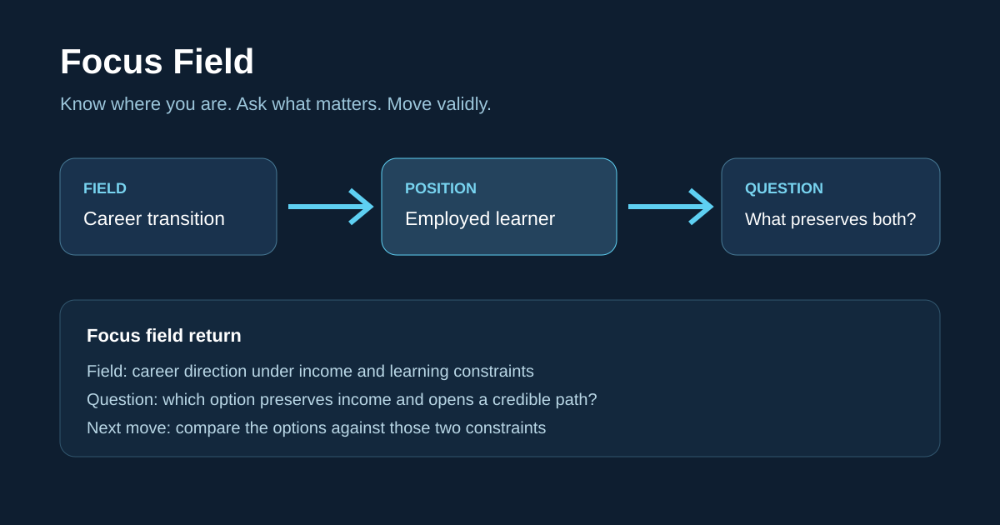

# Focus Field

**Know where you are. Ask what matters. Make the next valid move.**

Focus helps your AI make the situation behind a request explicit—its purpose, constraints and your position—then ask what matters and choose the next valid move.

## See it in 60 seconds

**“Use Focus to evaluate this.”**

During this project's GitHub release work, the author clarified the context:

> I want to publish on GitHub. Evaluate it in that context.

The field is a **personal, non-commercial release**. The author is presenting the project to first-time visitors. This gives the review a governing question:

> Can a first-time visitor understand when to use Focus and find a clear reason to try it?

- **Review criteria:** a clear use case, an easy trial, inspectable evidence, and a maintenance burden one person can sustain.
- **Judgment:** ready to invite public trials; the opening needs to show how locating the field changes the question and next action.
- **Next move:** show that connection in the existing README and Release.

The context gives “evaluate this” a purpose, a point of view and usable criteria. Focus applies this orientation structure to research, personal decisions and evolving projects.

*Translated and condensed from an author–assistant conversation on 2026-09-08. The author explicitly identified the publishing context. This is a usage example; measured results are linked below.*

[Install Focus](#install) · [See the experiments](#evidence)

<details>
<summary>Inspect a recorded revision test and its limits</summary>

**A key premise has failed. Which parts of your work still hold?**

In a controlled theory-revision test, the model was told that new evidence contradicted a premise. With Focus, it stated the governing question:

> After the premise is contradicted, which conclusions still have valid evidence?

The same run recorded three concrete decisions:

1. **Withdraw** the conclusion whose supporting evidence had failed.
2. **Keep** the earlier version as history and the unaffected work closed.
3. **Reopen** only the affected scope in the recorded plan.

*Translated and condensed from one controlled model run. The prompts explicitly requested revision; this example shows recorded question-and-action behavior.*

[Download the original evidence](https://github.com/qq783840671-png/recursive-center-field-theory/releases/download/v0.5.0-alpha.3/focus-evidence-2026-09-08.zip)

### Recorded source and limits

Source: `typed-revision-n3/runs/theory-revision__focus-none__seed-12.json` inside the evidence archive; `gpt-5.6-luna`, condition `focus-none`, seed label `12`, events `tr-04` and `tr-05`.

- `tr-04` prompt: “新实验反驳必要前提，撤回受影响结论并保留旧版本。”
- Recorded governing question: “必要前提被反驳后，哪些结论仍可由有效证据支持”
- Recorded action: `withdraw-affected-conclusion-and-revise-premise`; current version became `theory-v2`, with `theory-v1` retained as history.
- `tr-05` prompt: “只重开受冲突影响的最小论证范围。”
- Recorded output excerpt: “依据 ev:dependency-audit，仅重开受 contested premise 直接影响的最小论证范围；未受影响结构保持关闭，theory-v2 及 theory-v1 历史谱系均保留。”

These are the model's declarations in a structured test. The harness supplied evidence identifiers and revision requirements, rather than a full domain argument or underlying experiment. The run used Skill text plus a ledger, without calling the full runtime. It illustrates how a question relates to revision decisions; independent problem discovery and performance advantage remain unproven. All three seed labels and comparison workflows are preserved in the archive; see [Evaluation](EVALUATION.md) for aggregate results and costs.

</details>

<details>
<summary>See the underlying revision structure</summary>

```text
FORM → DRIVE → REVISE → FOLD
locate   act      reopen    return
```



This is an explanatory illustration. Focus applies field orientation, governing questions and versioned revision to research, personal decisions and long-running projects.

</details>

## Install

The shortest path is a direct Skill install. Ask Codex:

```text
$skill-installer install https://github.com/qq783840671-png/recursive-center-field-theory/tree/main/plugin/skills/focus
```

Restart Codex or open a new task so the new Skill catalog is loaded.

The repository also contains a one-Skill plugin package for marketplace distribution:

```text
codex plugin marketplace add qq783840671-png/recursive-center-field-theory
```

Open `/plugins`, find **Focus Field**, and install it.

## Try it

```text
Use Focus: I am considering changing jobs, learning a new field, and protecting my income. I have too many directions and do not know what to decide first.
```

Focus locates the decision before trying to solve it:

```text
Focus field return
Field: a career-direction decision under an income floor and learning goal
Effect: formed a workable position from competing directions
Position / governing question: employed learner / which option preserves the income floor while opening a credible learning path?
Center / next move: sustainable transition / compare the three options against those two constraints
Closure / version: field formed; decision remains open
Open residue: actual income floor and time horizon
```

The same structure can frame a research question, locate the center of a project, or maintain a long-running task when evidence invalidates an earlier conclusion:

```text
Use Focus: this research topic is too broad. Locate the field and find the smallest question that can change the conclusion.

Use Focus: finish this release. Keep the acceptance criteria, and reopen only the work affected by new test evidence.
```

For a simple request such as `Use Focus: what is 2 + 2?`, it answers `4` and returns `NOOP`. It does not manufacture a field when none is needed.

## What Focus does

- locates the active task field and its completion contract;
- locates the subject or task's current functional position;
- selects one current center without erasing relevant peer centers;
- derives the governing question from the smallest unresolved difference that can change the center, legal frontier, or closure;
- follows necessary partial order instead of a flat priority list;
- opens detail only where the parent task requires it;
- invalidates dependent conclusions when their support fails;
- preserves closure versions, branches, evidence, and reopen points;
- folds child results back into the parent task.

## Where Focus sits

| Mechanism | Primary question | Typical result |
|---|---|---|
| Prompt framework | How should the request be expressed? | an instruction pattern |
| Workflow | What known steps should run? | a sequence and status |
| RAG | What relevant material can be retrieved? | document fragments |
| Knowledge graph | What entities and relations are connected? | nodes, relations, and paths |
| **Focus** | Where am I in this field, what question matters, and what move is valid now? | position, center, governing question, next move, and reopenable version |

Focus does not discover truth automatically. It does not replace retrieval, knowledge graphs, domain tools, permissions, or the parent model. Its runtime validates recorded structure; domain claims still require domain evidence.

## The theory

[Focus Field Theory](THEORY.md) is the compact English statement of the full system. Its central proposal is that a finite subject can act within unbounded information by constructing a task-relative field, locating a functional center, moving through necessary relations, and revising that location when reality changes.

“Motion is absolute; stability is relative” remains the philosophical orientation. The engineering claim is narrower and falsifiable: explicit field, center, dependency, evidence, and version state may reduce drift, stale conclusions, illegal jumps, and rework under equal budgets.

## Evidence

The current implementation covers field formation, persisted functional position and governing question, one-next-decision control, typed knowledge deltas, dependency-scoped invalidation, immutable closure versions, branches, and recursive fold/unwind.

Automated tests establish runtime and package invariants; they do **not** establish general superiority. A three-seed typed-revision calibration found a small structural gain over an equal-ledger baseline at substantial protocol cost. The protocol, exact limits, and comparison harness are in [Evaluation](EVALUATION.md).

## Repository

```text
plugin/       the Focus Field plugin and its single Skill
evals/        behavior cases and the comparison harness
tests/        public package and runtime tests
THEORY.md     the complete concise theory
EVALUATION.md claims, metrics, and evidence limits
```

Everything else is release, legal, or contribution infrastructure. Internal conversation records and the larger Chinese research archive are intentionally excluded.

## Status

This is an experimental, source-available alpha. It is not a natural law, a complete ontology, or evidence of universal performance gains.

Version: `0.5.0-alpha.3` · License: [CC BY-NC 4.0](LICENSE)

Contributions should provide a reproducible failure, counterexample, comparison, or narrowly scoped improvement. See [Contributing](CONTRIBUTING.md), [Security](SECURITY.md), and [Legal](LEGAL.md).
