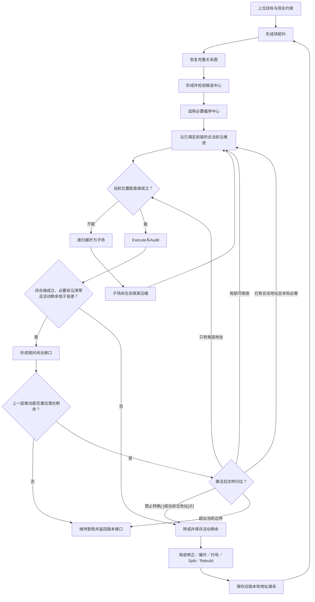

# 递归中心场偏序动力模型：维护母稿 v0.18

> 文档身份：本文件是“递归中心场偏序动力模型”的专门规范入口和后续维护母稿。它承接上位哲学思想与方法论，但不替用户改写二者；它向下约束 Focus 协议、状态实现、测试和公开应用说明。当前版本是一套候选的结构动力学与离散事件状态模型，不宣称已经成为普遍自然定律，也不宣称已经完成连续数值动力学。规范上，本文件是由理论根节点`F0:C`打开的全局`F1`场实例；文中的`local_F0`仅为模型内部操作视图。

## 全局绑定与局部模型根：场契约、中心轴与边界

### local_F0.1 文档契约

本母稿的规范全局绑定为：

```text
global_root = F0
global parent = F0:C
global_depth = 1
field instance = F1@F0:C
local_F0 ≡ F1@F0:C
```

这是一项规范地址绑定，不表示现有机器状态已经完成迁移。本文内部出现的局部节点在写回时必须恢复`F1@F0:C`父路径，不能把`local_F0`登记成新的全局`F0`；例如`local_F0:A`的全局身份是`F1@F0:C:A`，若再打开A才进入全局`F2`。

权威关系固定为：

```text
用户的哲学思想与方法论
        ↓ 输入、约束、反例
递归中心场偏序动力模型维护母稿（本文件）
        ↓ 操作化
Focus 协议、状态结构、程序与测试
        ↓ 派生
公开文本、应用映射与实验
```

本文件负责：

- 把零散对话中的关键结构提炼成一个能持续修订的运动模型；
- 统一场、中心、偏序、递归、闭合、剩余、地址、执行和版本之间的关系；
- 说明哪些内容是用户明确思想，哪些是当前形式化，哪些已有程序验证，哪些仍待实验；
- 作为 Focus 协议、状态模式和测试修改时的上游模型依据；
- 在模型发现上位思想冲突时保存剩余并向上反馈，而不是擅自替用户决定哲学结论。

本文件不负责：

- 证明现实中的一切都必然拥有中心或唯一中心；
- 制定善恶、宗教、金钱或人生选择的评价标准；
- 用程序能够运行来证明本体论主张为真；
- 自动修改公开正文、GitHub仓库或上位哲学文档；
- 把未经对照实验的AI、上下文或强化学习优势写成事实。

来源状态使用五种文字标记：

| 状态 | 含义 |
|---|---|
| 用户明确 | 用户在对话中反复确认的结构要求 |
| 当前模型定义 | 为使要求可表达、可执行而采用的候选形式化 |
| 已实现 | 当前 Focus 状态助手或测试已经支持的行为 |
| 工作假设 | 可以检验，但还没有充分证据 |
| 开放问题 | 当前无法无失真闭合，必须继续保留 |

量化与例证遵守以下书写纪律：

- 规范性判据优先使用带定义域、量纲和来源的符号参数；对话中的随手数值不能直接取得理论常数、默认门槛或经验事实的身份；
- 每个具体数值必须能够被归类为：定义常量、经校准参数、经验观测、工程配置或纯示意。无法归类的数值应删除或改写为符号关系；
- 纯示意数字不得承担跨案例推论；工程配置只约束对应版本和运行环境；经验数值必须保留证据来源、测量条件和不确定性；
- 生活化例子只用于解释概念，不构成结构证据。规范正文优先使用可替换的中性工程案例，并明确例子不证明普遍同构。

### local_F0.2 根目标与闭合端

这个模型试图回答三个问题：

1. 一个有限主体面对复杂问题时，怎样形成一个足以行动、但允许失败的相对场？
2. 这个场怎样沿不可缺少的中介和必要先后运动，而不把所有关系混成一条线？
3. 当旧结构装不下新差异时，怎样保留差异、最小上溯、重构并形成可追踪的新版本？

一句话定义：

> 递归中心场偏序动力模型描述：一个由任务与现实约束限定的场，如何从相对中心起点展开出不可约的功能偏序，沿合法前沿推进；如何在必要位置递归打开子场，并在子场相对闭合后保真压缩；以及新差异如何成为剩余，推动场展开、升场、分裂、重构和版本生成。

场不是一条从起点通向终点的线。线只能表示一个被压缩的必要骨架或一次已经选定的执行轨迹；场还保存使骨架能够成立的构成差异、不可删除的中介功能、可替换载荷、条件关系、替代路径、递归子场、未实现地址和剩余。场的具体内容可以变化，但只要变化仍能被定位、继承并重新组织为相对稳定结构，场就保持运动中的连续性。

最核心的通俗说法是：

> 先说明“谁为了什么，在什么边界和条件下，做到什么才算完成”；再找出从中心起点走向闭合端时不可任意删除的功能位置和必要先后。运动只能从已经满足前提的位置继续。看不清的部分打开成子场，子场闭合后压回父场。当前结构无法容纳但又影响任务的差异成为剩余；剩余只沿最近上一层上溯，直到找到能够吸收它并重新闭合的位置。重新闭合的结构形成新版本，旧结构和地址谱系继续保留。

因此，它不是一棵分类树，也不是“最重要内容”的排行榜。它是一套在有限场中形成结构、沿结构运动、接受失败并保存版本的协议。

### local_F0.3 与上一层、下一层的接口

| 层 | 主要问题 | 本文件的关系 |
|---|---|---|
| 哲学思想 | 中心、相对稳定、开放、剩余和真理意味着什么 | 作为上位输入；模型不替代哲学论证 |
| 方法论 | 怎样区分命题强度、检验中心、保存反例和限定适用域 | 作为操作约束和失败条件 |
| 运动模型 | 场有哪些状态，怎样合法转换，何时闭合、重开或改版 | 本文件的直接责任 |
| Focus实现 | 怎样把模型变成状态、命令、审计、回滚和测试 | 本文件的下游实现 |

上位哲学可以提出“人会寻找中心”“场趋向闭合”“剩余触发重构”等思想；运动模型必须把“触发”解释为使旧闭合证书失效并启动重审，不能把剩余实体化为独立物理力。若形式化过程中出现冲突，冲突返回上位层，而不是由程序偷偷替哲学作结论。

### local_F0.4 选定中心与递归全景

本母稿自身采用以下最小充分承重中心：

```text
A 建立场契约
→ B 恢复完整关系
→ C 检验并选定偏序中心
→ D 递归展开、执行与压缩
→ E 判断相对闭合并处理剩余
→ A′ 返回可追踪的稳定版本
```

同一版本内，`A→B→C→D→E→A′`是必要功能偏序；新版本只能由`A′`携带未吸收差异返回下一版本的`A`，不能把跨版本反馈倒写成同一版本的环。

母稿不再把所有内容作为十八个并列章节铺开，而是组织为五个压缩功能投影：

```text
local_F0（全局F1@F0:C）：场契约、中心轴、闭合与返回接口
├─ K 核心动力投影：场、关系、中心、偏序、递归、闭合与剩余
├─ S 形式语义投影：地址、模态、运行状态、前沿与环
├─ O 操作执行投影：Global、Focus、Execute、Audit与失效传播
├─ V 维护版本投影：更新落址、最小上溯、谱系与版本
└─ E 证据验证投影：公共例子、实现状态、测试与失败条件
```

本母稿真正的局部中心仍是上面的`A→B→C→D→E→A′`。`K/S/O/V/E`是为了维护文档而建立的跨切面压缩投影，不构成第二套同级中心，也不自动取得递归地址。只有当某个具体中心节点依法打开、建立自己的场契约和偏序后，才在全局`F2`生成子场实例。五个投影都必须通过接口返回局部模型根：`K`提供动力结构，`S`提供可表示状态，`O`提供合法运动，`V`保存跨版本继承，`E`限制主张强度。

## 功能投影 K：核心动力结构

### K.1 联合模型：不能删成孤立模块

一个版本化递归中心场的当前候选写法是：

\[
\mathbf F^v=
\langle
\Gamma_F,\Delta_F,G_F,\Pi_F,\widehat{\mathbb K}_F,\mathfrak C_F,K_F^q,
\operatorname{Exp}_F,\operatorname{Comp}_F,
\operatorname{Cl}_F,P_F^{req},P_F^{latent},
\Lambda_F,R_F^a,U_F^{\uparrow},A_F,T_F
\rangle .
\]

| 对象 | 作用 |
|---|---|
| `\Gamma_F` | 场契约：主体、目的、边界、尺度、成功与失败、证据和容差 |
| `\Delta_F` | 当前状态与闭合条件之间必须经由中介处理的构成差异；它使场保持未完成，但不自动产生现实运动 |
| `G_F` | 当前场内完整的带类型关系全景 |
| `\Pi_F` | 从完整关系中投影出的必要功能先行偏序 |
| `\widehat{\mathbb K}_F` | 当前证据允许、尚待检验的中心候选集合 |
| `\mathfrak C_F` | 当前完整场的中心分解、活动中心、跨中心关系、联合闭合与谱系 |
| `K_F^q` | 当前Focus投影选用的一个已激活承重中心；它对自身义务`\Omega_q／\Gamma_q`最小充分，不代表对完整多中心场契约单独充分 |
| `\operatorname{Exp}_F` | 把位置或关系打开为完整子场 |
| `\operatorname{Comp}_F` | 把相对闭合子场压回可重开接口 |
| `\operatorname{Cl}_F` | 相对闭合判据 |
| `P_F^{req}` | 当前父场闭合必须打开、实现或由有效接口承担的必要前沿 |
| `P_F^{latent}` | 合法存在但本轮不要求打开的潜在前沿 |
| `\Lambda_F` | 尚未被当前推动激活的差异记录；可绑定合法地址、地址候选或暂时无地址，本身不是地址 |
| `R_F^a` | 已经影响根目标且当前无法无失真吸收的活动剩余 |
| `U_F^{\uparrow}` | 上一层场的必要地址、目标、约束、遭遇或选择通过父子接口传入的激活推动 |
| `A_F` | 地址、模态、更新运动和跨版本谱系 |
| `T_F` | 形成、展开、执行、审计、失效、升场、分裂和重构的转换规则 |

这些对象相互制约：

- 没有场契约，不能判断什么相关、什么算成功；
- 没有当前状态与闭合条件之间的构成差异，场没有尚待中介完成的转换；
- 没有完整关系，偏序会把因果、语义、冲突和耦合提前丢掉；
- 没有必要偏序，运动可能跳过不可缺的中介；
- 没有中心检验，偏序可能只是一条漂亮但空洞的链；
- 没有递归和压缩，宏观位置不能打开为微观结构；
- 没有闭合与剩余，模型既不知道何时足以行动，也不知道何时必须重开；
- 没有地址与版本，更新只能覆盖旧文本，不能形成可追踪运动。

### K.2 场契约与场—中心共构

场契约 `\Gamma_F` 至少声明主体及上级目的、当前需求、起点与闭合端、定义域和尺度、允许改变与禁止偷换、证据和失败条件、容差、版本与外部依赖。

非根子场还必须声明单一主父契约绑定`primary_parent`：其中包括`parent_field_id`、`parent_address`、父场要求的功能与输出、允许能力和资源、展开深度或分辨率要求、局部闭合标准、失效影响以及`parent_return`。这些字段共同说明“为什么打开这个子场、打开到哪里、怎样返回”；缺少它们时，子场中心只能是未授权候选，不能支持父场闭合。多父DAG暂不在本版伪装为已解决。

当前需求通常不是凭空出现的第一推动，而是上一层场中一个尚未实现的必要地址。若父场`F_p`中的地址`u`不能直接成立，它可以向下展开为子场：

\[
\operatorname{Exp}_{F_p}(u)=F_c.
\]

父场把入口状态、预期输出、闭合条件、失败影响和返回接口传给子场；对子场而言，这是`U_c^{\uparrow}`，对包含父子场的更大递归结构而言，它仍是场内跨层运动。当前注意力使用的`local_F0`只是本轮操作根，不要求它是本体论上的绝对最高需求，也不得覆盖持久全局根；完整根路径保存它从哪些上一层地址展开而来。

当主体、目标、边界或成功条件存在会改变地址合法性的实质歧义时，形成过程自身构成一个场：

\[
\text{原始要求}
\prec \text{候选契约与中心恢复}
\prec \text{授权主体审查／修正／否定}
\prec F0^{+}.
\]

确认前的对象记作候选`F0^{\Diamond}`；确认是形成场的必要地址，不是活动剩余，也不表示运行任务已经完成。已有稳定契约可以通过可追溯确认记录复用；若根契约发生实质重构，确认必须失效并重新进入必要前沿。

同一对象进入不同场，会承担不同功能身份。地址只说明它在当前场中的结构角色，不说明它脱离一切关系后的永久本质。

场与中心通过迭代共同形成：

```text
需求与现实约束形成暂定场
→ 从代表性对象和关系中恢复候选中心
→ 用候选中心反查边界、遗漏中介和空洞归属
→ 修订、分裂或升高暂定场
→ 再次检验中心
→ 执行并接收现实反馈
→ 当前稳定，或继续重构
```

中心不预设必然存在或唯一。若没有候选通过检验，应报告中心恢复失败、`Split`或`Rebuild`，不能用一个适用于所有场的空洞词强行闭合。

### K.3 中心：起点和偏序结构必须同时保留

#### K.3.1 三个不能混同的“中心”

| 名称 | 含义 |
|---|---|
| 构成内核 `P` | 这套理论怎样建场、找中心、展开、压缩和处理剩余 |
| 场中心 `K_F` | 当前场从中心起点到闭合端的承重功能偏序 |
| 当前 Focus `q_t` | 本轮优先深入哪些合法路径、各自深入多少 |

`q_t`可以改变观察深度，不能删除`K_F`中的必要位置，也不能偷换场契约。

#### K.3.2 场中心的候选表达

\[
K_F=(X_F,C_F,\preceq_F,c_F,Z_F,\mathcal J_F),
\qquad
\ell_F:X_F\to\mathcal P(L_F).
\]

- `c_F`：中心起点或起点集合；
- `X_F`：从起点通向闭合所不能任意删除的功能地址或角色；
- `C_F`：使这些功能地址能够构成当前场且不能无失真删除的条件，包括当前状态与闭合条件之间的构成差异`\Delta_F`；
- `\preceq_F`：必要功能偏序的自反闭包；
- `Z_F`：闭合端或闭合端集合。
- `\mathcal J_F`：并联分支的有类型汇合规则集合；每条规则至少绑定分叉位置、分支集合、汇合位置、满足算子和必要的时间兼容条件。
- `\ell_F`：功能地址在当前版本采用的具体载荷集合；载荷可替换不等于功能地址可删除。

程序和协议中通常存储严格必要先行关系`\prec_F`及其无环覆盖边；理论中的`\preceq_F`是加入相等关系后的自反闭包。前者便于DAG和Hasse表示，后者是数学偏序本身。

“某个对象是中心”说的是中心起点；“中心是偏序结构”说的是从起点到闭合端的承重方向；构成条件则说明为什么这些位置能够形成当前这个场。三者缺一不可。具体工具、材料或实现方式可以替换，只要它仍承担同一功能地址并保持父接口等价；不可删除的是功能位置、构成条件及其必要偏序。

“最小充分”不得脱离闭合义务单独使用。单中心场中的`K_F`相对于完整场契约`\Gamma_F`充分；多中心场中的单个`K_i`只相对于自身不可替代义务`\Omega_i／\Gamma_i`充分；只有带跨中心关系和联合闭合规则的`K_F^{multi}`才接受整场充分性审计。Focus选中的`K_F^q`继承对应中心的局部义务作用域，`selected_center_closure=1`不推出`field_closure=1`。

#### K.3.3 完整关系不等于偏序

完整关系图`G_F`可以保存必要或条件依赖、支持、证据、冲突、禁止、相似、语义、耦合、因果、反馈、递归包含和跨版本谱系。只有“后一个功能位置成立，严格要求前一个位置已经成立”的关系才进入`\Pi_F`。

Hasse边只是必要偏序的最简覆盖表示，不是场内全部关系。两个位置不可比，只表示当前场没有规定它们的必要先后；不表示它们无关，也不表示必须按权重强行排序。

并联结构不能只靠“不可比”三个字保存。若位置`s`分叉到反链`B_s={b_1,\ldots,b_n}`并在`z`汇合，模型必须登记：

\[
j=\langle s,B_s,z,g_j,\omega_j,\epsilon_j,E_j\rangle\in\mathcal J_F .
\]

其中`g_j`是汇合满足算子，可以表达`ALL`、`ANY`、`K_OF_N`或领域聚合／约束函数；`\omega_j`是采样时刻、有效时间窗、稳态假设或其他同步策略；`\epsilon_j`是允许容差；`E_j`保存汇合证据。并联只否定分支间被强加的必要先后，不自动断言它们物理独立或严格同时。排他实现属于替代载荷或条件子偏序，不能冒充`ALL`并联。

普通`\preceq_F`只保存无条件必要先行关系。`ANY／K_OF_N`等条件分支的入汇合边留在`\mathcal J_F`，不能全部登记为普通Hasse必要边；给定本轮分支选择与满足状态`\sigma_t`，模型由`\preceq_F + \mathcal J_F + \sigma_t`诱导活动最小充分偏序`K_F^{\sigma_t}`。因此`H_t`只需对当前活动必要边保持下闭，不要求未选替代支路同时完成。

#### K.3.4 中心候选检验

中心候选至少接受删除、替代、顺序、不可比、汇合、压缩、闭合、环和空洞九项检验。汇合检验核对分叉、分支义务、满足算子、时间兼容条件和联合输出，并区分并联、替代与聚合。删除检验分别作用于功能地址、构成条件和必要关系；替代检验先替换地址载荷，只有角色、依赖、适用范围或接口随之改变时才判定为结构变化。当前程序能够保存和校验部分既有检验结果，但尚不能保存或自动校验本版汇合规则，也不会自动完成真实世界中的检验；判断仍由分析者或Agent提供证据。

#### K.3.5 场、中心与轨迹不能混同

中心`K_F`是场中不可删除的承重结构，完整关系图`G_F`保存围绕中心形成的条件、支持、冲突、替代实现和递归关系，一次实际执行轨迹`\rho_F^{exec}`则只是从合法可能结构中实现出来的有限路径。因而：

\[
\rho_F^{exec}\subseteq G_F,
\qquad
K_F\subseteq G_F,
\qquad
\rho_F^{exec}\neq K_F\neq G_F.
\]

把场画成一条线会同时丢失偏序宽度、可替换载荷、条件关系、递归深度和未实现地址。即使一次执行轨迹是线性的，产生并约束这条轨迹的场也不是一条线。

#### K.3.6 单中心候选、活动中心集与多中心系统

一个场可以同时保留多个中心候选，但“有多个候选”不等于“多中心已经成立”。规范上区分：

\[
\widehat{\mathbb K}_F
\supseteq
\mathbb K_F^{\sigma_t},
\qquad
\mathfrak C_F=
\left(
I_F,\{K_i\}_{i\in I_F},R_F^C,\mathcal J_F^C,\Sigma_F^C,L_F^C
\right).
\]

- `\widehat{\mathbb K}_F`：尚待检验的候选中心集；
- `\mathbb K_F^{\sigma_t}`：当前版本与分支状态下承担闭合义务的活动中心集；
- `R_F^C`：中心之间的必要、共需、约束、支持、竞争、冲突、聚合和共享位置等有类型关系；
- `\mathcal J_F^C`：中心级联合闭合规则；
- `\Sigma_F^C／L_F^C`：中心状态与出生、激活、分裂、合并、替代、降级和失效谱系。

只有当活动中心不少于两个、每个中心分别通过候选检验、同时承担不可替代的父契约义务，而且不存在一个接口等价的单中心能够无失真替代全部活动中心时，当前场才登记为多中心场。删除任一活动中心必须使至少一项必要义务、中心级汇合规则或父接口在当前容差内失效。

功能等价的多个载荷仍属于同一功能位置的实现族；`ANY`规则下尚未选中的方案仍是候选；普通并联分支只有在独立承担中心级闭合义务时才升级为活动中心。多个无共同非空洞契约的结构应保存为平行场，而不是用“多中心”强行统一。

多中心不是多个孤立中心的清单。每个活动中心保留自身的`K_i`，场级承重结构由：

\[
K_F^{multi}=
\operatorname{Compose}
\left(
\{K_i\}_{i\in I_F^{active}},
R_F^C,
\mathcal J_F^C
\right)
\]

形成。`Compose`必须保留中心归属、共享位置、跨中心关系和联合闭合语义，不能把所有节点无类型取并集，也不能按显示顺序伪造中心间必要偏序。`K_F^{multi}`是场级中心系统的复合显示，不重新进入单中心候选集；若复合结果仍保留多个可独立闭合、失效和重开的中心身份，它只是多中心包装器，不是一个接口等价单中心。完整定义见`30_理论体系/多中心动态场域论/递归偏序多中心动态场域论.md`。

给定场契约、任务尺度`\sigma`和允许的父接口语言`\mathcal L_{\Gamma,\sigma}`，每个活动中心还必须具有可独立审计的中心签名：

\[
\Theta_i=
\langle
\Omega_i,Cl_i,I_i,Fail_i,Reopen_i,Lineage_i
\rangle .
\]

其中`\Omega_i`是不可替代闭合义务，`Cl_i`是中心自身闭合状态，`I_i`是父向返回接口，`Fail_i／Reopen_i`保存可独立定位的失效与重开条件。若多个候选可以在`\mathcal L_{\Gamma,\sigma}`内压缩为一个中心`K_*`，并且不保留逐中心身份或状态向量仍能恢复父场决策、失败定位、重开入口和谱系，则它们属于一个复合单中心；若压缩必须继续携带`\{\Theta_i\}`才能保真，则只是把多中心装进一个外壳，不能据此执行`center-merge`。这一不可约判断相对于契约、尺度、版本和接口语言，不宣称存在脱离语境的唯一中心分解；若两个分解都通过检验且不可比较，应保留分支而不是强选唯一答案。

多中心系统属于每个完整场实例的全景，不直接成为Focus运行面。给定本轮任务与副场契约`q`，Focus通过任务相对投影`P_q`选出一个已激活中心`K_q`；未选中心只以平级场引用、候选或已审计压缩接口保留。任一位置或关系递归打开以后，先形成完整子场候选；该子场可以形成失败、单中心或多中心。只有Focus进入该子场时，才再次投影为一个局部选定中心。因而“完整场可多中心”和“Focus偏域单中心”在每一递归层都同时成立。

### K.4 递归展开、压缩和多场

#### K.4.1 展开

父场中的位置或关系可以打开为子场：

\[
\operatorname{Exp}_F(u)=\mathbf F_u.
\]

子场必须有自己的契约、完整关系、中心候选、必要偏序、闭合端、剩余和容差。它不是在原标签后机械追加一个数字。

父场前驱必须能够接入子场入口，子场闭合端必须能够接回父场后继。不同场可以选择不同的展开轴，因此同一现实事件从行动者、对象或互动关系出发，会形成不同的微观结构。

若父偏序中`p\prec u\prec s`，而子场中心为`c_u\preceq\cdots\preceq z_u`，实现层必须保存`p\prec c_u\preceq\cdots\preceq z_u\prec s`。这叫偏序代入或`Lift`：数字后缀只显示递归包含，不能让父场执行绕过子场承重中心。候选替代路线可以并列保存，但只有被选定且满足契约的路线进入当前活动实现子偏序。

若打开的是并联位置，`Lift`必须保留分叉—分支—汇合子图，而不是任选一种线性扩展塞回父链。各分支可以在不同递归深度闭合；汇合位置只在`g_j`及`\omega_j/\epsilon_j`成立后返回父场。一次执行因资源限制而先运行某一分支，只改变轨迹和调度，不增加分支之间的必要偏序边。

展开至少区分两种结构运动：

1. **中心保持的递归展开**：在已有地址或关系内部增加分辨率、机制、条件分支或子场深度；展开后的子场仍能压缩回同一父接口，`K_F`保持不变。
2. **承重中心生长**：新差异经检验证明某个条件或功能地址对当前场身份、必要路径或闭合端不可删除，于是该位置由偶然载荷、普通前沿或活动剩余晋升为中心成员，形成`K_F\hookrightarrow K_F'`。局部中心可以生长而上一层压缩接口仍保持等价；只有父接口被破坏时才继续向上重构。

载荷替换、地址加深和中心生长不能混同。载荷替换保留地址和接口；地址加深打开已有功能；中心生长改变当前层的不可约承重结构。

#### K.4.2 压缩

只有子场相对闭合并满足父场接口义务时，才能执行：

\[
\operatorname{Comp}_F(\mathbf F_u)=I_u.
\]

合法接口至少保存入口、输出、功能契约、成立条件、证据、适用范围、容差、未解决差异、当前版本和重开地址。若子场含并联，接口还必须保存分叉地址、分支义务、汇合算子、时间兼容策略和联合输出证据。压缩改变显示深度，不改变结构必要性；不得把并联子图压成一条伪串联长链。新证据使接口失效时，必须重开子场并传播失效。

当前实现可以记录压缩接口和重开条件，但尚未机器证明“该接口一定来自一个已经闭合的完整子场版本”。这是实现层的开放缺口。

#### K.4.3 三个尺度不能混同

- 递归深度：一个位置向下打开了多少层；
- 偏序高度：必要偏序中的最长链；
- 偏序宽度：最大不可比位置集合。

路径更长不表示更重要；展开更深也不表示更接近真理。

#### K.4.4 模型内层级展开不等于真实结构复原

**用户明确**：本理论首先是一套人为构造的工程拟合模型。它用场契约、中心、偏序、递归层级、分辨率、压缩接口和相对闭合组织观测现象、任务轨迹与工程知识，但不代表对象自身的结构，也不承诺从现象唯一反演某个“高维真实场”。

本母稿未加限定的场记号`F`默认表示任务／认识／工程契约场`F_task`。现实对象是否具有相似过程结构只进入上位本体论假设`H_ontic`；当前不定义一个与`F_task`同构的`F_ontic`，也不允许由运行成功、跨域拟合或投影相似推出`F_task=F_ontic`。若未来引入本体场，必须另给对象独立的状态、关系、可区分预测和证据条件。

若目标对象或过程记为`\mathcal W`，观测、实验或任务输出记为`y=O(\mathcal W)`，本模型给出的预测或解释记为：

\[
\widehat y
=
M_{\theta,\Gamma}(x),
\qquad
\widehat y\approx y
\not\Rightarrow
M_{\theta,\Gamma}=\mathcal W .
\]

即使同一套生成语法可以用于数学对象、波形、微观实验、宏观任务或AI工作流，也只表示模型能够为这些对象建立任务相对的结构映射、拟合曲线或解释接口；不表示这些对象由递归中心场生成，更不表示它们共享一个已被证明的世界本体结构。傅立叶、勒贝格积分、分形、多分辨率分析和有效场论仍是外部数学／物理工具或比较谱系，不是本理论的本体证明。

因此本母稿中的“维度”默认指模型记录或任务表示中的自由度、中心宽度、递归深度、分支复杂度、交互秩和尺度层级。若讨论神经网络隐藏维数、物理时空维数、几何维数或观测模态，必须另行声明，不得由`F_n`递归深度自动推出。

### K.5 相对闭合、剩余和动力来源

#### K.5.1 相对闭合

场达到相对闭合，不表示世界已经结束。它只表示在当前契约、版本、证据、深度和容差下：

- 闭合端成立；
- 普通必要前驱和当前汇合状态选定的必要子场已成立；
- 每个活动并联汇合规则已按自身算子、时间策略和容差满足；
- 压缩接口仍有效；
- 必要前沿`P_t^{req}`已经清零；
- 任务相关的活动剩余低于容差；
- 结构足以支持当前行动或交付。

相对闭合允许普通潜在前沿`P_t^{latent}`和潜在剩余`\Lambda_t`继续存在。稳定不是把一切可能性耗尽，而是当前没有未完成的父场义务、没有足以打断闭合的活动剩余，也没有正在把潜在地址激活为现实任务的上一层推动。父场提高精度、功能、安全或证据要求时，旧接口可能失效，相关`P_t^{latent}`才转入`P_{t+1}^{req}`。

操作上将闭合审计候选记为：

\[
ClosureAudit_t=
\langle structural_t,interface\_error_t,
active\_residual_t,evidence_t,latent\_openness_t\rangle .
\]

其中`structural_t`检查普通串联前驱、当前汇合规则和闭合端；`interface_error_t`按父场契约检查输出误差；`active_residual_t`判断剩余是否仍阻断；`evidence_t`检查证据；`latent_openness_t`记录仍可重开的潜在前沿与潜在剩余。前四项满足当前`\Gamma_F/\epsilon_F`时，场可以相对闭合；`latent_openness_t`非空不否定闭合。五项不得平均成未经领域定义的单一闭合百分比。

工程测量还应按需要分开记录：任务输出误差`\rho_t^{task}`、模型预测与实测残差`\rho_t^{model}`、守恒／平衡残差`\rho_t^{bal}`以及测量不确定性`u_t^{meas}`。以电路为例，稳态节点满足`I_{in}=\sum_i I_i`；若考虑储能瞬态，可按统一符号约定写成`I_{in}=\sum_i I_i+dQ/dt`。理想电流与实测电流的差异优先定位到寄生阻抗、漏支路、瞬态、模型边界或测量误差，不能把它误报为电流凭空消失。

因此候选闭合判据为：

\[
Cl_F^{\Gamma,\epsilon}(t)=1
\iff
structural_t=1\land P_t^{req}=\varnothing
\land \operatorname{Audit}_{\Gamma}(active\_residual_t,interface\_error_t,evidence_t)
\leq\epsilon_{\Gamma}.
\]

`Audit_Γ`是领域契约，不预设所有误差和剩余都可无损压成一个标量。方法论上，任何闭合证书都只对声明的`F_task`、尺度、版本、证据和容差有效；“现实对象在本体论上都绝不可能形成绝对闭合结构”属于`H_ontic`层的上位哲学强命题，不由本模型或电路例子证明。

#### K.5.2 潜在剩余与活动剩余

广义的剩余资源暂记为：

\[
\mathcal R_t^{*}=\Lambda_t\mathbin{\dot\cup}R_t^{a}.
\]

其中：

- `\Lambda_t`是潜在剩余：尚未成为当前任务中的现实问题、但具有明确激活条件的差异记录；它可以绑定合法地址、地址候选或暂时无地址，本身不是地址、也不带地址模态；
- `R_t^a`是活动剩余：已经被当前目标、证据或上一层推动激活，并且不能被现有结构无失真吸收；
- 当前程序中的`R_t`仍只记录狭义活动剩余；`Σ_t`继续专指完整运行状态，`L_t`继续专指Global展开分辨率。

潜在剩余可以处于休眠状态。它是下一次展开的养料，却不是展开必然发生的充分原因。普通未知、噪声、场外材料和普通未展开前沿也不自动成为潜在剩余。

一个差异只有影响当前根目标及验收、无法由当前中心或地址无失真吸收、尚未被合法处理，并超过当前容差或必须继续追踪，才进入活动剩余`R_t`。

#### K.5.3 激活、路径与闭合不能混成一种“力”

一次再展开由四种不同作用共同构成：

- `\Lambda_t`提供尚未实现的材料；
- `U_t^{\uparrow}`提供现实激活和方向选择；
- `\Pi_t`约束合法经过次序；
- `Cl_t`判断何时足以停止并返回相对稳定。

对于一个由父场必要地址`u`展开的子场，完整运动先写为：

\[
F_p[u]\xrightarrow{\operatorname{Exp}}F_c,
\qquad
s_t\xrightarrow{M_c,\Pi_c}s_{t+1},
\qquad
\operatorname{Cl}_c(F_c)=1
\Rightarrow
\operatorname{Comp}(F_c)=I_u
\Rightarrow u:[\Diamond]\to[+].
\]

父场必要地址提供子场建立和现实执行的上层推动；`\Delta_c`表示当前状态仍不满足闭合条件，因此使子场保持开放，但差异本身不会完成转换；中介`M_c`使现实状态发生变化；偏序`\Pi_c`规定不可跳过的功能方向；`Cl_c`是停止、压缩和返回父场的闸门，不是把场吸向终点的独立力量。闭合以后，子场内部结构压缩为父地址`u`所需的返回接口，并启用父场后继。

已有相对稳定场的再张开仍可写成：

\[
\operatorname{Reopen}(F_t)
=\operatorname{Activate}(\Lambda_t,U_t^{\uparrow};\Pi_t).
\]

当前理论在这里采用结构性、离散事件式表达，不把连续量化或形式证明设为本版本的闭合前提。若以后引入量化，量首先附着在地址、地址转换和版本谱系上，例如地址深度、跨度、可达性、激活次数、剩余传播范围、父接口破坏范围以及地址的保留、分裂、合并和退休。由这些地址运动统计得到的“压力”“流率”或“稳定性”只能作为候选导出量，不能在没有定义和证据时被设为独立的基础实体。

“外部推动”具有尺度相对性：对当前子场而言，上一层目标或约束来自场外；对包含它的更大递归场而言，这仍是整体内部的一次跨层推动。

#### K.5.4 激活以后的分流

```text
潜在剩余保持未激活 → 场维持暂稳态
潜在剩余被激活
→ 现有局部结构可无失真吸收：记录吸收并结束
→ 已绑定合法地址且本轮闭合需要：进入 P_req
→ 只绑定地址候选：先标定，验证后新生地址或拒绝候选
→ 已有合法地址但当前转换被禁止：记录 [-] 寻址结果并进入活动剩余
→ 当前场无合法表达／生成路线：记录 [∅] 寻址结果并进入活动剩余
→ 明确超出当前边界：外部化并保留来源

```

潜在剩余可以通过`address_binding=bound(address_id)`连接一个`[◇]`地址，但并非每个普通`[◇]`前沿都是潜在剩余。前者必须保存差异、激活条件、来源和处置谱系；后者只是合法但尚未展开或实现的结构位置。

#### K.5.5 剩余怎样推动承重结构生长

剩余不直接设计新结构。它首先证明旧地址、中心或压缩接口不能按原条件闭合。其结构运动固定为：

```text
现实差异进入
→ 尝试由最近既有地址和接口吸收
→ 载荷可替换且接口等价：局部替换
→ 已有地址可表达：递归展开或局部修正
→ 当前无法无失真吸收：形成活动剩余
→ 检验缺失条件或功能是否不可删除
→ 若不可删除，将其晋升为承重地址或构成条件
→ 写入正确的必要偏序和关系位置
→ 重审受影响的后继与压缩接口
→ 接口等价则停止；接口不等价则最小上溯
→ 重新闭合并保存旧新版本谱系
```

活动剩余提供的是“旧结构不能继续假装闭合”的约束；新地址放在哪里、是否进入中心以及怎样排序，仍由场契约、证据、删除／替代检验和父接口决定。普通未展开内容不因存在而使中心生长。

#### K.5.6 绝对的相对稳定：维护原则而非普遍保证

用户提出的上位原则是：模型追求的不是某个永恒不变的中心，而是“绝对的相对稳定”。当前运动模型只把它操作化为一个有失败条件的二阶维护原则：具体中心、地址、载荷和闭合版本可以变化，维护系统尽量连续保存差异定位、偏序调整、谱系和再稳定能力；它不保证任何现实场都必然存在稳定态，也不保证系统自身永远能够恢复中心。

\[
F_t^{\mathrm{stable}}
\xrightarrow{\text{差异／推动}}
F_t^{\mathrm{open}}
\xrightarrow{\mu_{t\to t+1}}
F_{t+1}^{\mathrm{stable}},
\qquad
F_t^{\mathrm{stable}}\neq F_{t+1}^{\mathrm{stable}}.
\]

这里至少区分：结构稳定、任务闭合、运动稳定和版本稳定。一个任务可以尚未闭合但中心和身份稳定；一个场可以正在重构但地址运动、证据和谱系仍然稳定。开放不等于无结构，稳定也不等于停止变化。

“总能找到相对稳定态”的当前可审计含义是：局部中心失效不会被隐藏为纯粹混乱，而会被定位为替换、展开、剩余、升场、分裂、重构或明确阻断；即使当前场为`[∅]`，该失败也能在上一层维护场中取得来源和处置位置。它不主张每个任意划定的场都能在有限时间内找到唯一正确中心，也不保证所有现实任务最终成功闭合。若用户以后把“总能”提升为普遍本体论保证，需要另行向上论证。

把失败定位为失败只证明审计协议仍在工作，不得反过来宣称原任务已经稳定或理论预测已经成功。若维护协议无法保存证据、无法形成可比较的新候选，或只能不断增加结构而不改善预测和行动，它自身也必须被判为阻断或失败。

#### K.5.7 层级贡献预算与展开停止

结构必要性、条件贡献预算、经验敏感度、Focus优先级和展开成本是五种不同变量。仅当父位置的效果能够被一组不重叠、近似穷尽的并行子贡献表示时，才定义：

\[
W(c)=W(p)\alpha(c\mid p),
\quad
\alpha(c\mid p)\ge0,
\quad
\sum_c\alpha(c\mid p)+\alpha_{res}=1.
\]

此时单个子项的全局贡献预算不超过父项；`\alpha_{res}`保存未建模贡献，不能为了满足和式而伪造子地址。串行必要链、阈值变量、强交互和非线性放大必须保存在其他关系类型或交互位置中，不得套用并行份额规则。地址深度本身不推出经验影响单调下降。

贡献预算只在合法、依赖就绪的同级候选中帮助分配展开分辨率。候选停止闸门为：子场未解析贡献上界已低于父任务容差，压缩接口有效，交互不确定性和安全风险可接受，而且继续展开的资源成本高于预期收益。该闸门是科研和学习系统的待验证策略，不是已经证明的最优策略。

#### K.5.8 事件因果角色与触发接口

完整关系图`G_F`中的因果相关位置至少允许标注：`source`（能量／资源来源）、`structural-condition`（长期承重条件）、`amplifier`（放大或耦合机制）、`threshold`（临界条件）、`trigger`（触发载荷）和`propagation`（实际传播轨迹）。这些角色不自动全部进入必要偏序；只有后继成立严格要求的功能先行关系才投影到`\Pi_F`。

若删除某个触发载荷后，其他载荷仍可通过同一接口触发结果，则该载荷可替换，不能被提升为整个宏观场中心。数量增加不能补齐缺失前驱；数量跨过阈值并改变功能身份时，应`Rebuild`或`Split`后重新赋址。地址深度和因果强度分别记录，避免用“路径很长”推断“影响必然很小”。

#### K.5.9 部分观测下的认识闭合

认识任务至少区分目标事件／对象场、测量场、估计或解释场、决策行动场。观察者、传感器、模型、噪声条件和分辨率进入认识场契约；估计结果作为带不确定性、证据路径和适用条件的压缩接口返回父任务，而不是冒充目标本身。

认识场的闭合要求必要观测前沿清零、估计不确定性进入父任务容差、关键证据路径可追溯且活动剩余不阻断行动。高噪声本身不等于黑箱；关键转换地址、证据链或剩余来源无法恢复时才形成结构性不可解释。现实通过残差、预测失败和行动后果使接口失效，因此观察的场相对性不等于主观任意主义。

### K.6 局部模型根返回接口

核心动力投影只有在以下内容都能返回局部模型根时才可压缩：选定中心和必要偏序、当前闭合判据、潜在与活动剩余的状态、上一层推动的来源、未解决差异、版本和重开地址。缺少其中任何承重接口时，不能把该投影报告为已经闭合。

## 功能投影 S：形式语义与运行状态

### S.1 地址及其四种判断

逻辑全地址的候选结构为：

\[
a=\langle
global\_root,global\_depth,field\_id,primary\_parent,
root\_path,\text{功能位置或关系},\text{功能身份}
\rangle .
\]

这是稳定逻辑`address_id`的候选结构。版本化记录另行保存：

\[
\hat a_t=\langle address\_id,address\_revision\_id,
field\_version\_id,panorama\_version,calibration\_status,
modality,evidence,provenance\rangle .
\]

地址候选与合法地址必须分账：`A_t^{cand}`保存尚在标定的结构假设，状态只能是`hypothesized／calibrating／rejected`；只有通过场契约、父绑定、功能身份、必要偏序、版本与反例标定的记录才进入`A_t^{legal}`，并取得稳定`address_id`。因此`[◇]`不再承担“有待验证”的含义，它只标记**已经标定为合法、已经表示、但尚未执行并通过Audit**的地址。候选被拒绝不是`[-]`；`[-]／[∅]`是寻址或转换结果，进入`AddressResult_t`，不进入合法地址集合。

其中`F_n`只表示全局递归深度；同一深度的多个场实例由`field_id + primary_parent + root_path`区分。当前先采用单一主父绑定，同一对象跨场复用时保持`object_id`，但建立不同的`field_id/address_id`；多父DAG仍是开放问题。

`center_membership`属于版本化地址记录，不属于稳定`address_id`。它不为每个中心复制地址，至少保存`center_system_id、center_id、center_role、obligation_ref、status、obligation_status、evidence_ref、validity_window、closure_effect`，并可引用中心关系、中心级汇合规则和中心谱系。同一地址可服务一个或多个中心，也可只属于场的外围关系图。地址级`modality`只说明该位置是否实现，不能自动把所有中心义务都标为满足；每项中心义务必须分别由`obligation_status`和相应证据审计。中心归属变化通常推进`address_revision_id`和`field_version_id`；只有场身份、父绑定、根路径或功能身份改变时才迁移稳定`address_id`。

完整场全景可以保存多值`center_membership`；进入Focus偏域时，绑定只保留一个`selected_center_ref`和必要的`peer_center_refs`。后者是返回上位全景的接口引用，不参加当前Focus的中心偏序、Ready计算或递归替换。

当前机器实现仍使用较窄的旧F0显示地址，例如`F0:A1.2`。关系主要由关系ID保存，版本由独立`field_version_id`保存，而不是全部塞进地址字符串。因此必须区分：

- 稳定逻辑全地址：理论上包含场、位置或关系、根路径与功能身份，不包含版本时钟；
- 版本化地址记录：以稳定`address_id`为锚，另存`address_revision_id`、`field_version_id`、`panorama_version`、模态、证据与来源；
- 全局显示地址：使用`F_n@root_path:node`显示递归深度和场实例；
- Focus局部地址：使用`local_F_n`显示当前操作视图，但不覆盖逻辑全地址；
- 机器节点地址：当前状态助手实际接受的节点式地址。

当前机器层还不能把任意关系直接作为独立递归锚点，也未实现全局深度与局部Focus深度的分离，这是后续实现前沿，不能假装已经完成。

地址传播采用非对称规则：父地址的非等价变化可以沿根路径向下重排后代地址；任一子地址运动都会写入`M_t`并推进`panorama_version`，但祖先`address_id`保持`retain`。子场向上返回的是接口结果、证据、失败和剩余，它们可以改变父场闭合状态并触发父场重审，却不能直接生成父地址迁移。只有父场自身或更高层重新定场，改变父场功能身份、父绑定或根路径时，才推进父地址迁移并向下重排。

四种模态分属不同判断层：

| 标记 | 判断 | 含义 |
|---|---|---|
| `[+]` | 实现 | 当前版本已经执行并通过Audit |
| `[◇]` | 合法未实现 | 当前场已经完成地址标定并登记合法路径，但尚未执行并通过Audit |
| `[-]` | 转换 | 某个直接转换被当前契约或必要偏序禁止 |
| `[∅]` | 表达 | 当前场没有无失真的合法地址 |

几个硬边界：

- 普通未展开位置属于`[◇]`前沿，不是`[∅]`；
- 未完成标定的地址假设属于`A_t^{cand}`，不是`[◇]`地址，也不得进入已审计前沿；
- 暂时缺少输入不自动成为理论剩余；
- `[-]`只否定当前直接转换，不否定所有替代路径；
- 可靠反例若当前无地址，应成为`[∅]`剩余并向上推动重构，不能因为与理论冲突就藏进`[-]`；
- 四种模态都相对于具体场和版本，不是关于世界的绝对判断。

### S.2 运行状态

完整运行状态可以按六组理解，不必一次记住全部符号：

| 组 | 主要变量 | 回答的问题 |
|---|---|---|
| 身份与契约 | `global_root, global_depth, field_id, primary_parent, root_path, goal_contract_id, v_t, \Gamma_t` | 这是哪个场实例、从哪里打开、为了什么、按哪一版验收？ |
| 关系与中心 | `G_t,\Pi_t,\widehat{\mathbb K}_t,\mathfrak C_t,K_t^q,\mathcal J_t,JoinState_t` | 完整场有哪些候选与活动中心、跨中心关系是什么、Focus当前选哪个中心、中心内部并联怎样汇合？ |
| 地址与成立 | `address_id,address_revision_id,field_version_id,panorama_version,M_t,H_t,L_t` | 哪些逻辑位置已表示、哪些记录修订、哪个场版本有效、全景处于哪一快照？ |
| 前沿、闭合与剩余 | `ActionFrontier, ExpansionFrontier^{req}, ExpansionFrontier^{latent}, Compressed,\Lambda_t,R_t,\chi_t,ClosureAudit_t` | 现在能做什么、什么必须展开、什么可延后、什么被压缩、闭合各维是否满足、什么仍无法吸收？ |
| Focus与执行 | `q_t,Q_t,V_t,D_t,Ready_t,E_t,O_t` | 本轮完整局部状态是什么、显示哪种不等深视图、执行哪个合法子偏序？ |
| 更新与谱系 | `U_t,A_t,\mathcal V_t^F` | 原始更新怎样落址、运动和形成闭合版本？ |

完整可持久化Focus状态记为：

\[
Binding_t^q=\langle global\_root,field\_id,primary\_parent,root\_path,
global\_depth,focus\_base\_depth,
source\_center\_system\_id,source\_field\_version,
selected\_center\_ref,peer\_center\_refs,
projection\_certificate,parent\_return\rangle,
\]

\[
Q_t=\langle q_t,Binding_t^q,local\_F0,local\_depth,
\Gamma_t^q,K_t^q,\Pi_t^q,\mathcal J_t^q,JoinState_t^q,
P_t^{active},I_t^{compressed},ExpansionFrontier_t^q,
ActionFrontier_t^q,R_t^q,ClosureAudit_t^q,v_t^{map}\rangle .
\]

`local_F0`只是当前Focus的局部操作别名，并满足`global_depth = focus_base_depth + local_depth`。`V_t^q`只是由`Q_t`生成的本轮不等深显示／工作视图，不等于完整`Q_t`。保存或回返Focus时必须保存`Q_t`及其全局绑定；仅保存`V_t^q`会丢失未选前沿、压缩接口、版本、剩余与父场身份。

其中`projection_certificate`至少声明源完整场版本、源中心系统版本、选定中心、当前中心依赖的平级接口、被省略义务、投影假设和失效触发。Focus返回完整场时还必须交付：

\[
FocusReturn_t^q=
\langle
selected\_center\_closure,outputs,evidence,
peer\_interface\_effects,residuals,reprojection\_request
\rangle .
\]

`selected_center_closure=1`只证明当前中心偏域相对闭合，不推出完整多中心场闭合。只有完整场重新汇合全部活动中心签名、跨中心关系和联合闭合规则以后，才能生成`FieldClosed`判断。

#### S.2.1 已成立下闭集

令`H_t`为已经实现并通过Audit的功能位置集合。它必须是由当前汇合状态`\sigma_t`诱导的活动必要偏序`K_F^{\sigma_t}`的下闭集：若后继已经成立，其普通串联前驱以及本轮汇合规则选中的必要分支必须也成立或由有效压缩接口承担。

下一批结构上可推进的位置为：

\[
\operatorname{Enabled}_F(H_t)
=
\{x\notin H_t\mid \operatorname{Pred}^{ser}_F(x)\subseteq H_t
\land \operatorname{JoinSat}_F(x,H_t)=1\}.
\]

`Pred^{ser}`保存普通串联必要前驱；`JoinSat`依据`\mathcal J_F`检查汇合算子、分支返回、时间兼容性和容差。不可比位置可以并行，但资源队列的临时先后不能被写回成新的因果边；同样，尚未达到某个汇合条件也不能被误报成所有分支地址失效。

#### S.2.2 分型前沿、压缩接口与剩余

| 前沿 | 含义 |
|---|---|
| ActionFrontier | 前驱、权限和版本条件满足，当前可执行 |
| ExpansionFrontier.required | 已有合法`[◇]`地址，且当前父场闭合要求本轮打开、实现或由接口承担 |
| ExpansionFrontier.latent | 已有合法`[◇]`地址，但本轮父场契约不要求打开 |
| Compressed | 已闭合并折叠为接口，满足触发条件时可重开 |

`ActionFrontier`与两类`ExpansionFrontier`可以交叉引用同一合法地址，但进入理由必须分别记录；可执行不等于必须展开，必须展开也不等于已经就绪。`Compressed`记录的是已经闭合的可重开接口，不表示其子地址已经预先存在。前沿分类与地址模态正交：同一个`[◇]`地址可因契约变化从`ExpansionFrontier.latent`迁到`ExpansionFrontier.required`，也可在前驱满足后进入`ActionFrontier`，而不需要改变地址身份或模态。

普通前沿不是剩余，`ExpansionFrontier.latent`也不等于潜在剩余`\Lambda_t`。`\Lambda_t`是待激活的差异记录而不是地址，其`address_binding`只能取`bound(address_id)／candidate(candidate_address_id)／unaddressed`；它不继承`[◇]`。找到一个潜在地址只建立绑定，不自动吸收剩余。

#### S.2.3 主运动循环



这条运动具有方向，但不是宇宙目的论：方向来自当前场的目标、必要前驱和闭合判据。宏观确定性来自已经形成的必要顺序和稳定接口；不确定性来自不可比路径、未展开子场、证据不足和持续进入的剩余。

#### S.2.4 反馈与环

完整关系图可以有反馈环；同一版本的必要偏序不能保留未解释的环。遇到环时依次检查：

1. 是否把不同阶段或尺度压在同一时刻；
2. 能否展开成`A_t\prec\cdots\prec A_{t+1}`；
3. 能否有证据地压缩为一个协同功能位置；
4. 若仍不能偏序化，保存为`non-poset`剩余，并`Split`或`Rebuild`。

### S.3 压缩接口

形式语义投影返回局部模型根时，至少交付：兼容版本的完整运行状态、选定中心及必要偏序、三类前沿、活动剩余账本、压缩接口和合法下一状态。它只证明“结构可表示并通过一致性校验”，不替代现实执行或证据审计。

## 功能投影 O：Focus 操作、执行与失效传播

### O.0 当前调用层：父场执行权与Focus过程内建构

当前 v0.18 Focus Skill 不把本投影作为LLM之上的第二层权限闸门。LLM根据系统、开发者、用户、安全和专用Skill保留实际执行权；Focus在同一父任务内部持续提供结构形成、导航、失效、版本和回卷决定：

```text
FORM: init --mode constructive → frame
→ DRIVE: return one next decision
→ parent action: expand or execute with evidence
→ REVISE when needed: ingest-delta → assess-impact
→ FOLD: fold → unwind for a child → validate / summary
```

Focus决定必须被父任务消费并影响下一步；若没有中心、前沿、合法性、闭合、版本或回溯变化，返回`NOOP`，不得制造地址。`[+]`仍只授予具有非空证据的位置。地址只为导航、约束、证据、记忆或重开审计生成，不把普通工具步骤和文字段落自动地址化。

v0.17 `init --mode sidecar→observe→reconstruct→fold`保留为已完成外部轨迹的导入和审计接口，不再定义新调用的默认顺序。禁止重复确认的层级边界继续成立：Focus不为自己增加许可、权限或用户确认；只有父任务自身需要新权限、不可逆选择或实质歧义时才询问用户。

### O.1 两种展开运动

| 运动 | 改变什么 | 不允许做什么 |
|---|---|---|
| Global Expansion | 在预算内让所有合法展开位置统一增加一层分辨率 | 不能按热度偷偷删掉分支 |
| Focus Penetration | 对一个或多个合法路径作不等深渗透 | 不能跳过必要前驱或把新地址直接标为`[+]` |

Global负责“不漏掉当前合法结构”，Focus负责“本轮看哪些路径、各自看多深”。二者都要把新增地址写回全景，并进行剩余与漂移审计。

完整场全景负责保存全部活动中心、中心级关系和联合闭合规则；Focus不复制这套多中心状态。任务相对投影形成的`Q_t^q`只运行一个`selected_center_ref=K_q`，同时以`peer_center_refs`保留投影证书要求的平级接口。Focus只对`K_q`内部一个或多个合法路径作不等深展开；中心的聚焦优先级不能改写成结构必要性，未选中心也不能因未进入当前运行面而从完整场全景删除。未选中心不得直接进入本轮`Ready_t`；它只能以已经审计的压缩输入接口被`K_q`引用，仍需执行时必须切换Focus、建立另一Focus实例或返回完整场调度。

活动地址的选择顺序固定为：先通过场契约、根路径、必要前驱、权限、版本和模态闸门；再从合法且就绪的同级候选中依据父场阻断程度、贡献区间、不确定性、交互风险、展开成本和证据价值排序。任何权重都不能制造地址、删除必要前驱或把低成本改写成高必要性。

非根Focus只显露满足父返回义务的最小充分局部中心，并由可配置预算`B_{\mathrm{Focus}}\in\mathbb N^+`约束本轮直接显示的父向承重接口数量。当前候选配置曾取`B_{\mathrm{Focus}}=3`作为复杂度控制窗口；该取值是待反例和实验校准的工程预算，不是理论常数或固定三点模板。实际必要接口少于预算时不得补点；确有更多不可压缩接口时不得为满足显示上限而删除，应该继续保存完整`Q_t`，将内部结构递归压入合法接口，或显式报告窗口溢出。

`F0→F1→F2→…`只表示从持久根场开始的全局递归深度，不表示Global或Focus快照。全景显示记为`GView_t`，Focus不等深视图记为`V_t^q`，完整可持久化状态记为`Q_t`。若Focus从全局`F_d`开始，局部`local_F0`绑定该场，局部`local_F_k`写回为全局`F_(d+k)`，且必须保留原`field_id`和`root_path`。

#### O.1.1 递归场栈、尺度标尺与分层回卷

只有展开而没有可定位回卷，Focus可能沿一个合法地址不断打开子场：每层都未达到局部闭合，却也没有把失败压缩返回父场；随着上下文和搜索预算耗尽，系统只剩线性经历，无法判断已经从哪一层、以何种分辨率进入当前分支。为此，模型增加候选递归场栈：

\[
\mathcal S_t^{field}
=
(\Phi_0,\Phi_1,\ldots,\Phi_{d_t}),
\]

\[
\Phi_k=
\langle
field\_id_k,parent_k,address_k,\Gamma_k,
\delta_k,\epsilon_k,\tau_k,
ClosureAudit_k,best_k,upper_k,
evidence_k,residual_k,reopen_k
\rangle .
\]

其中`d_t`是模型内递归深度；`\delta_k`是本层声明的最小有效尺度；`\epsilon_k／\tau_k`分别表示误差与可靠度要求；`best_k／upper_k`记录当前最好结果和可达上界。若尺度具有可比单位，还可另记：

\[
q_t=\log_{10}\frac{\delta_0}{\delta_t}.
\]

`q_t`表示分辨率跨越的数量级，不等于`d_t`。从`F_0`走到`F_d`只表示模型内递归深度增加了`d`，不保证恰好细化`d`个物理数量级；一次子场打开也可能同时改变中心宽度、分支数或交互复杂度。

监测层至少观察：地址重复、闭合残差的边际下降、有效证据增量、可达上界、上下文／时间预算和子场对父接口的实际影响。若连续若干步没有使地址前进、闭合缺口缩小或证据增加，或者`upper_k`已经低于本层门槛，则当前子场不得只以“继续思考”无限下钻，而应形成回卷摘要：

\[
\operatorname{Fold}(\Phi_k)
=
\langle
conclusion,evidence,best,upper,residual,
assumptions,reopen
\rangle ,
\]

再返回最近一个能够重新决策的祖先：该祖先仍有平级中心可切换、能够在父容差内吸收当前缺口，或有权重分配／契约重审入口。回卷保留全部来源引用和旧栈谱系，不把“退栈”写成历史删除，也不把子场失败直接改写成父地址迁移。

只对已由领域契约合法标量化、且“数值越大表示越满足要求”的某一审计分量`j`，设原门槛为`g_{\mathrm{old},j}`，当前证据估计为`\hat m_{k,j}`，并在同一量纲和校准口径下满足`\hat m_{k,j}<g_{\mathrm{old},j}`。此时只有两类合法处理：证明此前对子场要求传导过严，而父接口实际仅要求`g_{\mathrm{parent},j}\le\hat m_{k,j}`；或者把该分量契约显式修订为`g_{\mathrm{new},j}\le\hat m_{k,j}`并生成新版本。除此之外不得在原契约下把该分量报告为达标，更不得据此单独报告完整场闭合。未标量化的审计分量和结构硬门仍分别判断，不能由其他中心的加权贡献补偿。

构造型Focus运行时已经实现单帧`Fold`、逐层`Unwind`、父子地址留痕和显式`UNWIND`决定；v0.17 sidecar仍可重建实际观察到的递归层。停滞指标、可达上界计算、自动选择最近可决策祖先以及改善过度工程化的对照实验仍属于**模型形式化与 Agent 工程候选**。

### O.2 Execute与Audit

Focus形成活动视图以后，模型先用`\Pi_t + \mathcal J_t + JoinState_t`诱导当前活动必要偏序，再生成包含普通串联前驱、汇合规则选中分支和有效接口的可执行子偏序`D_t`，最后计算就绪波前`Ready_t`。只有实际执行并取得所需证据、通过Audit的结果，才能进入`H_t`并标为`[+]`。

当前实现的Agent负责根据自然语言恢复结构、提出中心和运动；状态助手负责校验闸门、验证delta、原子写入和审计。它不是一个无需判断、自己发现真实中心的自主模拟器。

### O.3 失效传播

若新证据否定必要前驱、关系、契约或压缩接口：

1. 把失效来源和证据写入状态；
2. 沿必要偏序重审所有后继；
3. 撤回或标记失去支持的旧`[+]`；
4. 阻止受影响的执行项；
5. 重开压缩接口；
6. 重审Focus路径和中心候选；
7. 保存旧版本并形成新的审计事件。

模型不能在前驱失效以后让下游继续无条件保持“已完成”。

在完整多中心场中，失效先沿受影响中心的内部偏序传播，再由上位全景依据`R_F^C`和`\mathcal J_F^C`重审相关中心、联合闭合和父接口。当前Focus只在失效破坏`K_q`自身、`peer_center_refs`、副场契约或返回接口时重开、重定场或上升；它不承担多中心联合失效调度。未受影响且证据仍有效的中心继续保留在完整场全景。

### O.4 压缩接口

操作执行投影返回局部模型根时，至少交付：本轮Focus视图、可执行子偏序、Ready波前、执行结果、证据、失效传播结果、产生和吸收的活动剩余以及一个下一状态决策。没有通过Audit的结果不能压缩成`[+]`接口。

## 功能投影 V：更新、地址运动与版本

### V.1 两层分类不能混成一套

理论语义定位层：

| 类型 | 含义 |
|---|---|
| `Ext` | 与当前根目标无关，留在场外 |
| `Sub` | 同一功能地址的载荷替换 |
| `Exp` | 进入合法潜在分支或打开子场 |
| `Neg` | 请求当前契约禁止的直接转换 |
| `Res` | 当前无法无失真吸收，需要保留为剩余 |

维护阶段层：

```text
external | local-replace | legal-expansion | principle-conflict
no-address-residual | subfield-rebuild | root-rebuild | version-branch
```

五种语义定位回答“它对当前理论意味着什么”；八种维护阶段回答“这一更新目前走到了哪一种处理结构”。同一更新可以先是`no-address-residual`，再依次进入展开、重构或分支，不能把阶段标签当作永久本质。

### V.2 固定维护链

```text
保存原始更新U<n>
→ 分配入口地址F0@U<n>
→ 保存来源、证据和源版本
→ 找到最近相关地址
→ 判断语义位置和当前维护阶段
→ 选择地址运动
→ 检查最近失稳位置
→ 子地址运动写回全景，祖先地址登记retain
→ 沿父接口返回结果、证据或剩余
→ 接口等价则停止，父地址和父场版本不变
→ 接口不等价则父场转入重审，但不由子场直接迁移父地址
→ 相对闭合后生成局部版本、根版本或分支版本
→ 保存旧新地址谱系
```

局部地址变了，意味着全局地址全景发生了变化，但不等于祖先地址或整个理论身份发生变化。影响规模由哪些地址记录发生修订、运动实际破坏了多少层闭合接口，以及父场是否经过自身重审后重新寻址共同决定。

### V.3 地址谱系

跨版本迁移不是单值重命名，而是关系：

\[
\mu_{v\to w}\subseteq
(A^v\cup\{\bot\})\times(A^w\cup\{\bot\}).
\]

它可以保存：

- `a→a`：稳定`address_id`与功能保持；其地址修订、模态或证据可以另有差分；
- `a→b`：迁移；
- `a→{b_1,b_2}`：分裂；
- `{a_1,a_2}→b`：合并；
- `a→\bot`：退休；
- `\bot→b`：新生。

旧版本保持只读。版本谱系表示可追溯继承，不表示新版本更真、更善或必然进步。

### V.4 六种彼此独立的身份与版本时钟

| 时钟 | 何时变化 |
|---|---|
| 运行修订 | 每次状态事件写入 |
| 地址修订 `address_revision_id` | 某一逻辑地址自身的载荷、接口或证据发生修订 |
| 全景图版本 | 地址或关系全景发生结构写回 |
| 场版本 `field_version_id` | 某一场的契约、中心或闭合结构改变并形成相应版本 |
| 根域语义版本 | 根接口或构成身份发生变化 |
| 文档修订 | 文字、排版、引用或例子发生变化 |

六者可以同时变化，也可以各自独立。任一子地址运动至少推进运行修订与全景图版本；只有该地址自身载荷、接口或证据变化时才推进其`address_revision_id`；祖先地址在新全景中保持`retain`。改一个不入理论地址的例子可能只产生文档修订；局部场重构可以推进局部场版本；根场构成身份改变才推进根域语义版本并重新确认。

### V.5 压缩接口

维护版本投影返回局部模型根时，至少交付：原始更新、最近相关地址、运动类型、最小上溯路径、父接口等价结果、旧新地址谱系、闭合审计和结果版本。仍未闭合的运动只返回开放状态与剩余，不能制造新闭合版本。

## 功能投影 E：证据、实现与验证

### E.1 公共例子：开源软件缺陷修复

“修复一个缺陷”通常不是第一层需求，而是“恢复一个可验证、可发布的项目状态”父场中的必要地址。该地址向下打开后，修复子场可以形成以下候选承重主轴：

```text
界定预期行为与当前失败之间的差异
≺ 复现并形成失败证据
≺ 定位首个结构性原因
≺ 通过某种干预中介改变系统
≺ 回归、集成与审查
≺ 返回“已验证修复”接口
```

具体调试器、诊断工具、补丁写法和测试框架都可以替换；不可删除的是“形成证据—定位原因—实施干预—验证结果”等功能地址以及它们的必要偏序。只给出一条补丁轨迹不是完整缺陷场，因为场还包括候选原因、替代干预、环境条件、冲突证据、未执行地址和可能剩余。

这不是说每一步只有一个分支：

- 本地复现、CI复现和用户环境复现可以是条件分支或不可比位置；
- 数据路径、状态转换和接口契约是不同候选原因；
- 局部补丁、结构修改和兼容方案可能是替代路线。

若Focus深入“接口契约”，它可以打开成子场：

```text
捕获接口异常
≺ 恢复调用方／提供方责任
≺ 定位前置、后置或版本契约违反
≺ 修复契约
≺ 验证上下游
```

子场完整结构在内部保存，回到父场时可以压缩为“接口契约已修复”的可重开接口。生成的深地址最初仍是`[◇]`；补丁真正执行且所需测试通过Audit后，才能成为`[+]`。

若原测试通过而一个已纳入支持契约的平台仍然失败，该差异会使“已验证修复”接口失效。模型先检查能否由现有兼容性地址吸收；若跨平台验证被证明是父场交付不可删除的条件，它就由普通分支晋升为承重地址，重审原修复的后继并形成新的局部闭合版本。若该平台不在当前边界内，差异可以外部化；若父接口也被破坏，活动剩余才继续最小上溯。这个例子同时展示载荷替换、递归展开、中心生长、闭合返回和剩余传播，而不把任何一种具体工具误当成中心。

软件仓库的提交版本与模型的“场闭合版本”不是同一概念，必须显式关联，不能自动等同。

### E.2 当前实现到了哪里

#### E.2.1 已实现并可验证

当前构造型schema `focus-constructive-2.0`已经支持：

- `init --mode constructive → frame → decide／expand／execute → ingest-delta → assess-impact → fold／unwind → validate`；
- 单个当前中心、平级中心引用、必要偏序、汇合、四类前沿和唯一下一决定；
- `ADD／REFINE／CONTRADICT／OUTSIDE／NOOP`差异分型和原始证据入口；
- 必要后继与汇合目标失效传播、父压缩接口重开、旧`[+]`撤回和闭合证书失效；
- 不可变场闭合版本、父版本链接、版本分支和三类版本轴分账；
- 已实现节点的非空证据闸门，以及选中中心闭合／完整场闭合分离；
- v0.17 sidecar状态的兼容加载，以及历史轨迹`observe／reconstruct`导入审计。

历史两阶段 Focus v2 状态和 schema 2.2 继续作为旧状态验证、恢复与迁移界面。下列`field_state.py`能力属于这一兼容层：

当前`field_state.py`和schema 2.2已经支持：

- F0确认闸门和执行前临时闭合闸门；
- 完整关系图、必要依赖投影、SCC检测与`non-poset`剩余；
- 中心候选、检验结果和选用证据的结构校验；
- 三类前沿、Focus不等深根路径、`D_t/Ready_t`；
- Execute审计、依赖失效传播和漂移审计；
- 原始更新入口`F0@U<n>`、多阶段地址运动和十种谱系操作；
- 最小上溯字段、局部／根场闭合版本、版本DAG和分支头；
- 根契约重构后重置F0确认；
- 状态变更的完整校验、原子提交和非法delta回滚。

这些结果证明“当前程序能守住这些结构约束”，不证明中心一定正确，也不证明方法具有经验优势。

Address Engine 0.4原型已经支持证据绑定的形成确认、非根地址父绑定、`action／expansion_required／expansion_latent／compressed`分型前沿、必要前沿闭合闸门、可选条件贡献区间和因果关系角色校验。它仍只验证所给状态的一致性，不会自动判断领域贡献或真实因果。

#### E.2.2 尚未自动实现

- 从自然语言自动恢复完整关系图和必要偏序；
- 自动发现、比较并选择真实中心；
- 自动完成删除、替代、闭合等中心实验；
- 自动判断更新分类、最小上溯范围和接口等价；
- 内置Global、Focus、递归展开和压缩算法；
- 无需Agent判断的独立场运动模拟器；
- 将功能地址、具体载荷、不可删除构成条件和必要偏序分别保存并联合审计的中心表示；
- 对`\Delta_F`以及结构稳定、任务闭合、运动稳定和版本稳定四种状态的独立机器表达；
- 地址深度、可达性、激活、传播、接口破坏和跨版本谱系等地址运动量化；以及在有定义和证据时由其导出的高层动力统计量；
- 对快照文件存在性与SHA内容的实际读取核验；
- 对“压缩接口一定来自已闭合子场”的机器证明；
- 关系位置作为完整递归地址的机器表达。
- `ExpansionFrontier.required`与`ExpansionFrontier.latent`的统一机器分型，以及与`\Lambda_t`的独立校验；
- 将完整Focus状态`Q_t`与派生视图`V_t`分开持久化并验证父返回接口；
- 条件贡献预算、交互超边、因果角色和部分观测接口的领域证据校验。
- 自动停滞检测、可达上界计算和最近可决策祖先选择；显式递归场栈、逐层`Fold／Unwind`与契约化退栈已实现基础子集。

因此，当前最准确的实现名称是：

> **可审计的递归中心场离散事件状态模型与维护内核。**

它是“完整动力学算法”的基础，还不是完成形态。

#### E.2.3 当前测试边界

当前 Focus 源测试共48项，其中7项直接覆盖构造型初始化、决策前沿、`NOOP`、必要后继失效、父接口重开、版本分支及失效后重闭合；其余覆盖 sidecar `observe／reconstruct`、证据闸门、兼容状态、候选／合法地址分层、单层递归、`Fold／Unwind`、前向形成闸门和地址运动。它们证明所记录的状态转换和证据约束由程序守住，不证明自动恢复了真实中心或具有经验优势。

多中心生命周期、跨独立状态全景汇合、自动语义重投影、`FrozenAudit`自动判退、领域证据有效性以及相对无Skill／旧sidecar的独立代理行为优势，仍需要更完整的反例与对照测试矩阵。

当前工作区的`theory-address-state.json`已恢复验证：旧`F0:A1—G3`数字编号被显式隔离为只读`legacy_display_addresses`，仅保留历史显示语义且禁止进入任何前沿或活动Focus，从而不补造`field_opening_audit`。本轮更新`U2／AM2`已落在`F0:C—H`并保存同址载荷谱系；由于根中心仍为`tentative`，机器状态保持`FIELD_FORMATION_REQUIRED`，不生成F0闭合版本。两阶段Focus schema 1.1与Address Engine 0.5已经共同采用候选／合法地址分账、四类前沿和独立潜在剩余绑定；旧schema记录通过兼容读取与显式迁移保留来源，不能以旧`modal_status=[◇]`继续证明潜在剩余自身是地址。

### E.3 压缩接口

证据验证投影返回局部模型根时，必须区分用户明确思想、当前模型定义、程序已实现行为、工作假设和开放问题，并交付相应证据与测试边界。没有对照实验的性能优势、没有形式证明的普遍命题和未实现的动力变量不能作为已验证结果压回局部模型根。

## 局部模型根返回接口：维护、开放边与版本记录

### R.1 以后怎样维护这个模型

#### R.1.1 固定入口

- 对话中的大变化先进入`08-对话继承与理论演化记录.md`；
- 本文件是运动模型的规范母稿；
- `02-理论内核候选稿.md`保存上位理论联合结构；
- `07-理论地址索引.md`保存人类可读理论地址；
- `theory-address-state.json`保存机器可审计的理论更新运动；
- `recursive-center-field-dynamics`开发目录保存Focus协议、状态助手和测试；
- `06-递归中心场论_公开文本候选稿.md`是派生公开文本，不因内部更新自动改写。

#### R.1.2 每次收到零散更新

1. 保存原始表达，不先替用户润色；
2. 提取会改变模型的最小原子命题；
3. 标记为用户明确、当前模型定义、已实现、工作假设或开放问题；
4. 找到模型中的最近功能位置；
5. 判断只是表述替换、合法展开、反例剩余，还是结构重构；
6. 做父接口等价检查和最小上溯；
7. 先更新本母稿，再判断是否需要同步协议、状态、测试或公开派生文本；
8. 重新检查术语、地址、版本和证据边界；
9. 只有相对闭合后才生成对应层级的模型版本；
10. 向用户报告本次吸收了什么、留下什么剩余、下一状态是什么。

#### R.1.3 修改权限

我可以在用户已经授予的运动模型范围内维护本母稿、Focus方法协议、状态结构、维护规则、验证测试及模型内部地址一致性。

遇到以下情况必须向上反馈：

- 需要改变“中心、场、偏序、递归、剩余”的上位哲学含义；
- 新证据与用户明确思想直接冲突；
- 需要改变理论根身份或建立`F0′`；
- 需要改动公开终稿、发布材料或GitHub状态；
- 多个模型版本都能闭合但彼此不可比较，需要用户选择或保留分支。

### R.2 必须长期保留的开放问题

1. “人会寻找中心”是结构假设、心理社会命题，还是本体论强命题？
2. 中心是否总能恢复、不同分析者能否形成可对照候选，以及真多中心与分析不足造成的候选并列怎样获得可复现区分？
3. “最小充分”“承重”“接口等价”和“相对闭合”怎样获得可复现判据？
4. 剩余的任务相关性和容差怎样测量？
5. 反馈何时可通过时间展开或功能压缩保留偏序，何时必须分裂？
6. 多场耦合何时是父子递归，何时是平行场或更大互动场？
7. `F0`连续修订与分叉为`F0′`的可操作边界在哪里？
8. 如何在不预设独立场能量实体的前提下，对地址深度、可达性、激活、传播、接口破坏和跨版本谱系建立可计算指标；以及是否有必要从这些地址运动中导出更高层动力统计量？
9. 结构中心与评价中心怎样耦合，而不让价值评价偷换必要偏序？
10. Focus是否真的降低上下文漂移、非法跳步和版本误用，收益能否超过维护成本？
11. 功能地址、具体载荷、构成条件和必要偏序怎样在机器状态中分别表达，并支持删除、替代与中心生长审计？
12. “绝对的相对稳定”是否只表示可审计的再定位与再闭合能力，还是要提升为任何场都必然找到中心的本体论强保证？
13. 现有理论地址状态怎样在不伪造子场证明的前提下补齐`field_opening_audit`并迁移到当前验证要求？
14. 并行条件贡献、串行必要性、交互项和经验敏感度怎样获得可复现的分型估计，未解析贡献上界怎样进入停止闸门？
15. 结构原因、放大机制、阈值、触发和传播轨迹怎样在不同领域获得反事实证据，而不退化成事后叙事？
16. 部分观测下的任务相对闭合怎样与具体控制可观测性、滤波一致性和模型失配指标对接？
17. 已明确的`Binding_t^q + Q_t + V_t^q`关系怎样进入统一schema，并保证回返时不丢失未选前沿、压缩接口和全局父场绑定？
18. 当一个场实例存在多个合法父场时，怎样保存路径相对身份、闭合义务和版本迁移，而不让共享对象被错误合并？
19. `\mathcal J_F／JoinState`怎样进入统一schema和执行器，如何为聚合规则、时间兼容和并联压缩恢复建立可复现反例测试？
20. 本版中心签名与接口语言怎样在不同领域形成可复现的不可约分解、复合单中心和多中心包装器反例判据？
21. 中心级`R_F^C／\mathcal J_F^C`怎样进入完整场全景schema，并通过带源版本的`ProjectionCertificate／selected_center_ref／peer_center_refs／FocusReturn`投影和回收，而不把支持、竞争或耦合误写成当前中心偏序？
22. 共享位置同时服务多个中心时，逐中心`obligation_status／evidence／validity_window／closure_effect`怎样参与闭合、资源竞争、证据失效和地址修订？
23. 中心分裂、合并、降级和跨版本重绑定怎样保存谱系，并与多场分裂及多父绑定严格区分？
24. 递归场栈的最小稳定字段是什么，怎样使线性对话、工具轨迹和完整场地址保持可逆对应？
25. 停滞监测怎样区分必要的困难长路径、证据等待、局部振荡和错误尺度下的无限细化？
26. 应退回一层、数层还是根场，怎样由可达上界、父容差、平级中心和契约修改权限共同决定？
27. `Fold`摘要怎样在限制上下文的同时保存证据、失败上界、假设、未闭合债务和重开条件？

### R.3 失败条件与非主张

若出现以下情况，模型必须缩小定义域、分裂或重构：

- 候选中心经删除后并不影响闭合；
- 不同分析者无法形成任何可比较的结构；
- 必要关系持续出现无法展开或压缩的同版本环；
- 子场压缩无法保存入口、输出、条件和证据；
- 并联子场压缩后无法恢复分叉、支路义务、汇合规则或时间兼容条件；
- 模型不能区分普通未知、合法前沿和真正剩余；
- 结构维护成本长期超过其带来的可追踪性与执行收益；
- 错误中心把有价值路径持续禁止或固化。
- 多个中心只是名称、候选、视角、载荷或普通并联分支的并列，没有独立闭合义务和联合规则；
- 所谓多中心可以被一个接口等价单中心无失真替代，或多个中心实际上没有共同的非空洞场契约。
- 模型把对现象的工程拟合或解释映射冒充对象自身结构、世界生成机制或唯一真实反演。
- 系统只保存线性文本而不保存递归父子地址、尺度和回卷接口，却声称能够可靠判断应退回多少层。
- 冻结版本的场契约、中心候选、证据标准或失败条件被事后改写，却仍把修订后的成功报告为旧版本成功。
- 面对反例只通过增加中心、改尺度或升场持续提高结构复杂度，既不保留旧版本判退记录，也不与更简单替代模型比较。

本模型当前不主张：

- 所有现实对象都有唯一中心；
- 所有`F_task`都必然是多中心，或中心数量越多解释力就越强；
- 所有关系都能进入同一个偏序；
- 所有运动都由当前场目标预定；
- 所有新奇或异常都是剩余；
- 地址越深，经验影响就必然越小；
- 一个触发事件等于宏观结果的全部结构原因；
- 任务相对估计闭合等于获得对象的完整真实；
- 新版本必然比旧版本更真；
- Focus Skill可运行就证明哲学为真；
- Focus已经优于RAG、知识图谱、HTN、工作流或强化学习基线。

任何经验或工程验证都应先生成`FrozenAudit`记录，至少固定：场契约和版本、任务尺度、中心候选／中心系统、证据标准、失败条件、比较基线和允许修订预算。冻结版本失败时，旧版本进入失败或判退状态；随后可以由反例生成新版本，但新版本不得覆盖旧版证据。吸收反例所增加的节点、中心、关系、尺度和维护成本必须计入模型比较。

### R.4 当前修订记录

#### v0.1

- 来源：当前对话、对话继承记录、理论内核、公开候选稿、地址索引、Focus协议与维护协议。
- 用户确认：由助手持续负责运动模型部分；上位哲学与方法论作为输入；建立专门文档并把零散关键内容吸收进模型。
- 本轮变化：第一次把模型的责任边界、联合状态、主运动循环、地址版本维护、实现边界和后续维护流程集中到一个规范入口。
- 未处理为既成事实：普遍中心、本体论强命题、AI性能优势和连续数值动力学。

#### v0.2

- 来源：当前对话中用户对“剩余可以有潜在地址、场可暂稳、上级场推动再次展开”的补充。
- 用户明确：潜在剩余可以作为下一次展开的养料而不立即实现；相对稳定的子场受到更高一级场推动时才可能重新张开。
- 本轮细化：把广义剩余区分为潜在剩余与活动剩余；把动力来源拆成材料、激活、偏序路径和闭合倾向；区分潜能激活式展开与剩余破裂式展开。
- 形式化边界：当时暂用`L_t`表示潜在剩余；该符号因与Global展开分辨率冲突，已在v0.3中被`\Lambda_t`替代。当前schema和程序仍未自动表示或测量潜在剩余与上一层推动。

#### v0.3

- 来源：用户要求用Focus优化模型，使母稿自身也符合递归中心场偏序结构，而不是把内容盲目并排。
- 根层保持：模型仍以“形成具有中心、必要偏序、递归运动、相对闭合和版本返回的可审计场”为同一F0，没有建立`F0′`。
- 结构运动：把十八个并列章节重组为根层以及`K／S／O／V／E`五个可展开子场，明确同版本中心偏序和跨版本返回接口。
- 形式修复：选定母稿自身的承重中心；将潜在剩余改记为`\Lambda_t`，广义剩余改记为`\mathcal R_t^{*}`，消除与运行状态`Σ_t`及Global分辨率`L_t`的冲突；把激活来源、偏序约束和闭合判据分开。
- 版本性质：这是一次模型母稿和核心动力子场的结构修订；旧概念未被覆盖删除，v0.1与v0.2的来源和变化继续保留。

#### v0.4

- 来源：用户确认当前阶段暂不引入数值动力学和形式证明，并要求用Focus完成自检后“先把这个定下来”。
- 用户明确：量化若在以后展开，首先落在地址及其运动上；当前理论以结构和离散事件表达达到相对闭合，不以连续动力参数或形式证明作为本版本闭合条件。
- 本轮审计：场契约、完整关系、偏序中心、递归运动、相对闭合与剩余、版本返回仍构成同一最小充分承重中心；同版本偏序无环，跨版本反馈由`A'_t→A_{t+1}`承载；潜在剩余、上一层推动、合法路径和闭合判据没有被混成一种力。
- 边界调整：未来的深度、可达性、激活、传播、接口破坏和谱系指标被限定为地址运动量；“压力”“流率”或“稳定性”只有从这些指标中获得定义和证据后，才可作为候选导出量。
- 局部修复：将母稿中误写的“四个子场”改为实际的五个子场；本次变化不破坏根层接口，不建立`F0'`。
- 闭合状态：当前版本记为理论相对闭合；自动中心恢复、程序测试、经验比较和未来地址量化保留为合法`[◇]`展开地址，不作为当前活动剩余。

#### v0.5

- 来源：用户围绕“为什么A到B构成场而不是线”“中介和差异为什么不可删除”“需求怎样来自上一层场”“闭合端怎样返回”“剩余怎样使承重结构生长”以及“绝对的相对稳定”所作的连续纠正与确认。
- 中心修订：中心由单纯的最小承重子偏序细化为不可删除功能地址、不可删除构成条件和必要偏序的联合结构；具体载荷允许替换，只要角色、依赖、适用范围和父接口保持等价。
- 场与展开：执行轨迹只是场的有限投影；递归展开分为中心保持的地址加深与改变当前层不可约结构的中心生长，并与载荷替换严格分开。
- 动力修订：当前需求被定位为上一层场必要地址向下展开的接口推动；构成差异使场保持未完成但不充当力；中介完成现实转换；偏序规定方向；闭合端作为压缩返回闸门；活动剩余通过阻断旧接口闭合，触发地址晋升、后继重审和最小上溯。
- 稳定原则：将“绝对的相对稳定”记为用户明确的上位原则，并在模型层操作化为具体中心可变而再定位、再组织、谱系保存和再稳定能力连续；有限时间内必然找到唯一正确中心仍不作为已证明命题。
- 公共例子：不采用本轮个人化出行例子；扩充“开源软件缺陷修复”例子，以展示不可删除功能中介、父子场返回、中心生长和剩余传播。
- 地址运动：根目标和母稿父接口保持可追踪，形成同一F0谱系下的根层模型修订v0.5，不建立`F0'`。现有机器地址状态因缺少递归地址打开审计而不能安全写入；中心联合表示和四类稳定状态尚未进入协议／schema，均保留为下游实现残余。
- 闭合状态：母稿在当前定义域内重新获得理论相对闭合；“绝对的相对稳定”的本体论强读法和机器状态迁移保留为`[◇]`，不伪装为已验证结果。

#### v0.6

- 来源：用户围绕强化学习探索、雷达科研失败复盘、参数层级贡献、宏观触发叙事、部分观测认识以及父场精度要求怎样激活子场所作的连续补充；详细来源见演化记录第40—45项。
- 场与闭合：补入非根场的父契约绑定、形成场中的授权确认、偏序代入，以及`P^{req}`／`P^{latent}`分型；相对闭合清零的是必要前沿和阻断性活动剩余，不要求耗尽全部合法潜在地址。
- Focus状态：明确`Q_t`是可持久化完整局部场状态，`V_t`只是其不等深视图；活动地址必须先合法、就绪，再由父场阻断程度、贡献、不确定性、交互风险、成本和证据价值排序。
- 贡献与因果：条件贡献预算只适用于有明确分解契约的并行贡献，不推广为“递归越深影响必然越小”；完整关系图新增资源来源、结构条件、放大、阈值、触发和传播的角色分型，地址深度与因果强度分开。
- 认识边界：把目标／事件场、测量场、估计／解释场和决策行动场分开；任务相对估计闭合不等于完整真实，高噪声不自动等于黑箱。
- 证据状态：上述结构目前是用户命题与模型形式化；其对强化学习性能、科研效率、因果识别和滤波质量的优势仍需领域实验，不写成已验证结果。

#### v0.7

- 来源：用户明确确认，Focus中的局部根只能作为局部操作地址；局部展开出的`A、B、C……`只是活动地址，但在根目录中仍须拥有可追溯的全局地址。
- 地址替换：`F_n`统一改为相对持久根场的全局递归深度，旧“F1—F4为Global／Focus快照”语义退出；快照分别使用`GView_t`、`V_t^q`和`Q_t`。
- Focus细化：新增`Binding_t^q`，保存`global_root、field_id、primary_parent、root_path、global_depth、focus_base_depth、parent_return`；`local_F0`只作为视图别名，并满足全局深度与局部深度换算关系。
- 母稿自寻址：本文件规范绑定为`F1@F0:C`，文内模型根改记`local_F0`；原`K/S/O/V/E`明确为维护用功能投影，不再与局部中心`A→B→C→D→E→A′`并列充当第二套递归根地址。
- 实现边界：现有机器状态、Focus schema和Address Engine尚未迁移；本轮没有修改程序、机器状态、测试或公开稿。

#### v0.8

- 来源：用户进一步明确，父场生成并约束子场地址；子地址运动不会向上改写父地址，但任何局部地址运动都会改变全局地址全景。同一对象或同一名称进入不同场时，应形成不同的场相对地址。
- 传播修正：地址重排只由父地址的非等价变化向下传播；子场向上返回接口、证据、失败或剩余，只能改变父场闭合状态并触发重审，不能直接造成祖先地址迁移。
- 版本分型：稳定`address_id`与`address_revision_id、field_version_id、panorama_version`分离；全景版本推进不再被误报为全景内所有逻辑地址发生迁移。
- 时钟扩展：运行修订、地址修订、全景图版本、场版本、根域语义版本和文档修订分别声明推进条件。
- 实现边界：上述字段和传播闸门尚未进入当前机器schema、Focus Skill或Address Engine；本轮只更新规范。

#### v0.9

- 来源：用户以逻辑门与并联电路指出，递归展开若只保存串联长链，会压平真实的多路关系并造成解释歧义；用户明确要求允许并联结构进入递归场。
- 中心扩展：`K_F`增加有类型汇合规则集`\mathcal J_F`；不可比分支通过分叉—分支—汇合子图进入中心，不再把某个线性扩展冒充完整偏序。
- 闭合扩展：汇合规则区分`ALL／ANY／K_OF_N／AGGREGATE`，并保存时间兼容策略、容差和证据；并联不自动表示物理事件严格同时。
- 递归与压缩：并联分支可以不等深展开；`Lift`保留并联子图，`Comp`可把闭合子图压成一个接口，但必须保存可逆恢复信息，不能压成伪串联链。
- 状态与实现边界：`Q_t`及运行状态候选增加`JoinRules／JoinState`；这些字段、就绪计算和并联压缩恢复尚未进入机器schema、Focus Skill或Address Engine，本轮只更新规范。

#### v0.10

- 来源：用户进一步确认，现实并联支路的输出与理想值之间通常保留差异；场可以满足当前任务而继续具有可展开开口，不能把相对闭合写成零误差、无损或绝对完备。
- 闭合细化：新增`ClosureAudit_t`，分别审计结构成立、接口误差、活动剩余、证据和潜在敞开；相对闭合允许`P_t^{latent}`与`\Lambda_t`非空，不使用无定义的单一闭合百分比。
- 残差分型：任务误差、模型残差、守恒／平衡残差和测量不确定性分开；电路中的理想—实测差异不得误写为电流凭空消失。
- 哲学边界：闭合证书只对已声明契约、尺度、版本、证据和容差有效；“任何现实场都不可能绝对闭合”继续保留为用户上位哲学强命题，不由本模型或电路例子证明。
- 实现边界：`ClosureAudit_t`及残差分型尚未进入机器schema、Focus Skill或Address Engine，本轮只更新内部规范。

#### v0.11

- 来源：用户明确要求把“多中心”更新进现有体系，并将新项目命名为“递归偏序多中心动态场域论”。
- 身份分型：新增候选中心集`\widehat{\mathbb K}_F`、活动中心集`\mathbb K_F^{\sigma_t}`和中心系统`\mathfrak C_F`，不再把多个候选自动称为多中心。
- 成立判据：真多中心要求至少两个同时活动、分别承担不可替代闭合义务的中心，并通过“不能被接口等价单中心无失真替代”的检验。
- 结构扩展：新增中心关系`R_F^C`、中心级联合闭合规则`\mathcal J_F^C`、中心状态和谱系；区分多中心、并联、多场和多父绑定。
- 地址与Focus：地址增加`center_membership`引用；完整`Q_t`必须保留所有活动中心，Focus只生成不丢失跨中心义务的派生视图。
- 实现边界：本轮建立内部规范和新理论入口；schema、Focus Skill、Address Engine、旧机器状态和公开稿尚未实现或同步多中心。

#### v0.12

- 来源：用户进一步澄清，完整场域可以多中心、平级和并行，但Focus的目的正是把当前任务压缩为一个单中心偏域平面；多中心运行时会使Focus失去聚焦优势。
- 层级校正：多中心系统只属于完整场域全景；Focus通过任务相对投影`P_q`选定一个`K_q`，递归子场也各自形成局部单中心。
- 状态边界：完整场全景保存中心系统；Focus的`Q_t^q`只保存`selected_center_ref`以及最小`peer_center_refs`，不计算多中心联合Ready。
- 动力澄清：副场契约给出闭合方向和返回义务，局部剩余、失效与新证据触发具体运动；不可绝对闭合与任务相对闭合继续并存。
- 实现决定：当前Focus Skill、schema 2.2和状态助手保持单中心，不再把缺少多中心运行时列为Focus缺陷。

#### v0.13

- 来源：对v0.12进行结构一致性审计后，发现复合单中心／多中心边界、完整子场／Focus投影层级、稳定地址归属、Focus绑定和共享地址义务状态仍存在直接冲突或高风险缺口。
- 不可约边界：每个中心增加`\Theta_i=<\Omega_i,Cl_i,I_i,Fail_i,Reopen_i,Lineage_i>`签名；只有无需保留逐中心状态向量仍能恢复父场决策、失败定位、重开和谱系时，多个中心才可合并为复合单中心。保留逐中心签名的`Compose`只是场级多中心包装器，不重新进入单中心候选集。
- 递归分层：任一位置或关系打开后先形成完整子场候选；完整子场可以形成失败、单中心或多中心，Focus进入时才投影为一个已激活中心。
- 地址修复：`center_membership`从稳定`address_id`元组移入版本化地址记录；共享地址的实现模态不再自动满足全部中心义务，各归属项分别保存义务状态、证据、有效期和闭合影响。
- 投影闭环：`Binding_t^q`补入源场／中心系统版本、`selected_center_ref／peer_center_refs／projection_certificate`，并新增`FocusReturn`；选定中心闭合不再被误读为完整场闭合。
- 实现边界：本轮只修订内部理论与协议，Focus Skill、schema 2.2、状态助手、机器状态和公开稿未修改。

#### v0.14

- 来源：用户纠正“高维真实复原”表述，并进一步提出：线性推理若不显式保存递归场层级、当前分辨率和父子地址，会在无限细化路径中丢失位置；仅有停滞监视器仍不足以判断应回退多少层。
- 模型身份：明确本理论是对观测现象、任务轨迹和工程知识的层级拟合模型，不代表对象结构本身；能够回收数学、波形、微观、宏观或AI现象，只表示可以建立解释／拟合接口，不构成本体证明。
- 层级分型：递归深度`d_t`、分辨率数量级`q_t`、偏序高度、偏序宽度、中心数量和交互复杂度继续分开；`F_n`只表示模型内全局递归深度。
- 回卷机制：新增候选递归场栈`\mathcal S_t^{field}`、停滞监测、`Fold`摘要和最近可决策祖先回退；门槛降低必须由父契约重审并形成可追踪版本，不能在原标准下伪造闭合。
- 分类边界：哲学层负责模型非实在与相对闭合边界；数学层负责模型内部形式和外部分析工具；AI层负责分层控制器；大语言模型层负责线性上下文、长文本迷失和回卷工程问题。
- 实现边界：本轮只更新内部理论与概念沉淀；Focus Skill、schema、状态助手、机器状态和公开稿未修改，性能收益仍属待验证假说。
- 表达审计：删除口述式闭合数值，把门槛降低改写为带量纲一致性要求的符号契约；将固定接口数明确降为可配置工程预算，并建立“定义／校准／经验／配置／示意”五类数字身份纪律。本项只提高表达严谨性，不新增经验结论。

#### v0.15

- 来源：使用新版两阶段Focus对哲学层开展本体论、认识论、时间—概率、方法论和主体信念五中心一致性审计；五个选中中心分别展开、折叠和回卷，综合场通过结构校验。
- 充分性作用域：单中心`K_F`对完整`\Gamma_F`充分；多中心中的`K_i`只对`\Omega_i／\Gamma_i`充分；`K_F^{multi}`才接受整场充分性审计。Focus选中中心闭合不推出完整场闭合。
- 动力术语：把“剩余推动”统一为“剩余使旧闭合证书失效并触发重审”；实际状态变化继续由上一层激活、主体选择和现实中介承担。
- 类型边界：默认场记号限定为`F_task`；对象自身结构只进入`H_ontic`，不由拟合、投影或可运行性推出`F_task=F_ontic`。
- 失败协议：新增冻结版本`FrozenAudit`、旧版判退和修订成本纪律；“绝对的相对稳定”降为可失败的维护原则，不以“成功记录失败”免疫原任务或理论预测。
- 实现边界：本轮修改理论文本和公开候选稿；未新增自然科学实证。历史两阶段 Focus 运行时已能保存选中／平级中心引用、投影证书、FocusReturn以及选中中心／完整场闭合分离；v0.17 sidecar 已能从实际轨迹重建证据绑定的主中心和平级中心，但完整多中心全景的中心生命周期和自动重新汇合仍未实现。

#### v0.16

- 来源：用户要求依据最新理论重新定义“潜在地址”，并明确授权同步更新理论、Focus Skill、运行时、测试与本机插件。
- 地址分层：新增`A_t^{cand}`与`A_t^{legal}`分账；`[◇]`只表示已标定合法、已表示但未实现的地址，不再兼任“有待验证”。`[-]／[∅]`固定为`AddressResult_t`，不进入合法地址集合。
- 前沿分层：`ActionFrontier／ExpansionFrontier.required／ExpansionFrontier.latent／Compressed`与地址模态正交；压缩接口可重开不推出其子地址已经存在。
- 剩余分层：`\Lambda_t`改为无地址模态的差异记录，以`bound／candidate／unaddressed`绑定地址；激活后分别进入局部吸收、必要前沿、地址标定／新生、`[-]／[∅]`活动剩余或外部化。
- 工程状态：两阶段Focus schema 1.1与Address Engine 0.5同步这一分层；旧schema兼容读取只保存历史来源，不把旧`modal_status=[◇]`继续解释为剩余自身的地址合法性。测试只证明结构约束由程序守住，不证明地址恢复或理论具有经验优势。

#### v0.17

- 来源：用户纠正Focus与LLM普通执行的层级关系，明确LLM的任务完成是父场，Focus应在结果后返回真实场域，不用前置闸门和重复确认阻断执行。
- 调用分层：新 Focus 调用不再预先构造中心或地址；父任务正常完成后，sidecar再对实际轨迹执行`observe→reconstruct`。
- 证据闸门：重建中每个已实现节点必须绑定非空观察证据；未观察结构只能保留为开放地址、候选、剩余或场外项。
- 兼容边界：历史两阶段`init→frame→expand／execute→fold／unwind`继续用于旧状态验证、恢复和迁移，不再是新调用的默认界面。
- 工程状态：v0.17 sidecar、41项 Focus 源测试和全局调用别名已实现；它们证明记录与证据不变量，不证明领域场的唯一真实性或经验优势。

#### v0.18

- 来源：用户指出纯后置sidecar没有参与建构，只是在结果后分发符号，并要求依据理论本身和成熟Skill的过程纪律完成重构。
- 层级修复：LLM继续拥有父任务执行权与授权判断；Focus从“后置观察器”改为无额外许可层的过程内结构子场，不恢复重复确认闸门。
- 运行循环：新调用使用`FORM→DRIVE→REVISE→FOLD`；运行时默认schema为`focus-constructive-2.0`，sidecar仅作历史导入与审计兼容。
- 差异与失效：新增`ingest-delta／assess-impact`、五类差异、五级传播范围、必要后继和父接口失效、闭合证书判退、版本分支及重闭合父版本链接。
- 地址纪律：地址必须承担导航、约束、证据、记忆或重开审计功能；无结构作用时返回`NOOP`，不为工具步骤或输出格式制造地址。
- 工程状态：48项Focus源测试与10项产品化测试通过；15项公开行为契约已更新，但尚未完成独立代理的无Skill／旧sidecar／构造型三组运行，因此不声称经验优势已经得到验证。
